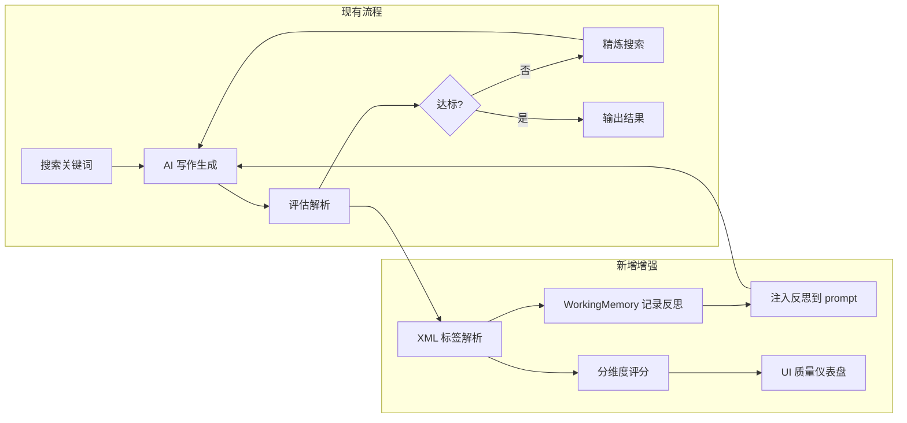

## 产品概述

增强 AIToutiao 引擎模式的内容质量评估可靠性和信息可追溯性。当前 pipeline 已正确实现了研究-写作-评估-迭代循环，但存在三个短板：评估器 JSON 解析不稳定、跨轮次反思未结构化累积、UI 未展示质量评估详情。

## 核心功能

### 1. 可靠的 XML 标签评估

将 `_evaluate_content()` 中的 JSON 输出格式改为 XML 标签格式（Anthropic 2026 官方推荐的 Evaluator-Optimizer 最佳实践）。XML 标签解析比正则匹配 JSON 大括号更稳定，尤其在 LLM 输出夹杂额外文字时不会误匹配。同时增加解析失败时的降级策略（逐项评分回归到规则检查）。

### 2. 跨轮次反思累积

在 `_research_and_write()` 中注入 `agent/memory.py` 的 WorkingMemory 独立 dataclass，每轮评估后将反馈记录到 `wm.add_reflection()`。后续轮次生成时，将累积反思注入到写作 prompt 的"历史改进要求"段落，让 LLM 看到之前所有轮的改进建议而非仅上一轮。

### 3. 质量评估仪表盘

在 `render_results()` 中新增质量评估面板：评分趋势表格（每轮的分项得分）、搜索关键词溯源、最佳轮次高亮。数据从已有 `state.outputs.eval_records` 中提取，通过 `_build_result()` 透传到 UI。

### 视觉效果

侧边栏保持暗色军事风不变。结果区在稿件上方新增一个折叠面板（默认展开），以紧凑表格展示每轮迭代的 5 项评分、反馈摘要和搜索关键词，最佳轮次行高亮为绿色。

## 技术栈

- 语言：Python 3.10+
- UI：Streamlit 1.58（已安装）
- LLM API：DeepSeek（通过现有 AIWriter._call_ai()）
- 可复用模块：`agent/memory.py` 的 WorkingMemory dataclass（独立，不依赖 Agent 框架其他部分）
- 依赖：`re`（正则）、`xml.etree.ElementTree`（XML 解析），均为标准库

## 实现方案

### 策略：增量增强，不替换

所有改动集中在 `engine_app.py` 单文件内。保持 `_research_and_write()` 主循环结构不变，只在其内部插入 WorkingMemory 记录和 Prompt 增强逻辑。评估器从 JSON 模式切换到 XML 模式，但函数签名和返回值保持不变。

### 三个修改点的因果关系

```
_evaluate_content() 输出 XML 标签
       ↓
  解析出 5 项分维度评分 + 反馈文本
       ↓
_research_and_write() 将反馈推入 WorkingMemory
       ↓
  累积反思注入下一轮生成 prompt
       ↓
  所有 eval_records 通过 _build_result() 透传
       ↓
render_results() 渲染质量仪表盘
```

### 关键设计决策

1. **XML 标签而非 JSON**：Anthropic 官方 Cookbook 明确推荐 `<evaluation>PASS/NEEDS_IMPROVEMENT/FAIL</evaluation>` + `<feedback>...</feedback>` 的结构化标签格式。相比 JSON，XML 标签更不容易被 LLM 的额外说明文字污染，正则提取更可靠。

2. **WorkingMemory 只取不返**：只导入 `agent/memory.py` 的 `WorkingMemory` dataclass 做反思累积，不接入 `agent/graph.py`、`agent/runner.py`、`agent/types.py` 的 `Reflection` 类。避免引入 Agent 框架的复杂类型系统。

3. **eval_records 扩展**：将现有的 `{"score": int, "feedback": str}` 字典扩展为包含 `{"score": int, "dimensions": {...}, "feedback": str, "search_queries": [...]}` 的丰富记录，既保持向后兼容又增加信息密度。

4. **完全向后兼容**：评估失败时 fallback 到旧的 JSON 解析尝试，再失败则默认通过（不阻断流水线）。

### 实现注意事项

- **性能**：XML 解析用标准库 `xml.etree.ElementTree`，无额外依赖，毫秒级完成
- **日志**：复用现有 `add_log()` + `sys.stderr.write()` 模式，评估解析成功/失败均记录
- **错误隔离**：评估解析失败不抛出异常，降级到规则检查并记录 warning 日志
- **blast radius**：所有改动限定在 `_evaluate_content()`、`_research_and_write()`、`_build_result()`、`render_results()` 四个函数，不触碰其余 2000+ 行代码

## 架构设计



## 目录结构

```
d:\AIToutiao\engine_mode\
├── engine_app.py          # [MODIFY] 单文件，集中所有改动
│   ├── _evaluate_content()    # 改：JSON → XML 标签解析 + 分维度评分
│   ├── _research_and_write()  # 改：注入 WorkingMemory 反思累积
│   ├── _build_result()        # 改：透传 eval_records/search_queries
│   └── render_results()       # 改：新增质量评估仪表盘
├── agent/
│   └── memory.py           # [READ-ONLY] 导入 WorkingMemory，不做修改
└── (其他文件不做任何修改)
```

## 关键代码结构

### 新评估 prompt 的 XML 输出格式

```xml
<evaluation>PASS</evaluation>
<score>85</score>
<dimensions>
  <事实准确>80</事实准确>
  <信息完整>85</信息完整>
  <结构清晰>90</结构清晰>
  <风格一致>88</风格一致>
  <去AI味>82</去AI味>
</dimensions>
<feedback>需要补充具体数据支撑第三个论点</feedback>
```

### 扩展后的 eval_records 条目结构

```python
{
    "iteration": 1,
    "score": 85,
    "passed": True,
    "dimensions": {"事实准确": 80, "信息完整": 85, "结构清晰": 90, "风格一致": 88, "去AI味": 82},
    "feedback": "需要补充具体数据支撑第三个论点",
    "search_queries": ["普京 乌克兰 最新进展"],
}
```