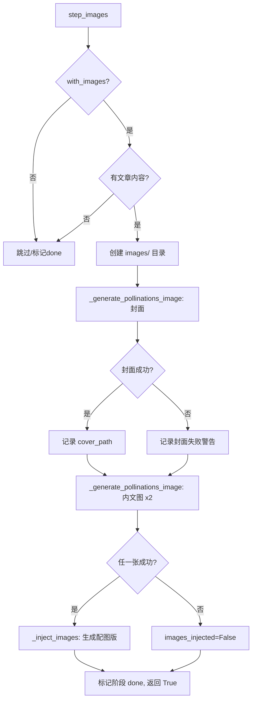

## 用户需求

1. 将当前 AIToutiao 项目代码备份到 GitHub
2. 整理归纳所有已发现的问题，给出解决方案
3. 按方案逐一解决问题
4. 使用抖音链接 `https://v.douyin.com/gRIX7gy75xc/` 进行完整流水线验证
5. 若测试未通过则继续修复，直至全部通过

## 已发现问题清单

### B. 待修复的关键问题

- **B1. 图片生成完全缺失**：DeepSeek `deepseek-chat` 是纯文本 API，无法生成图片。`.env` 中无任何图片生成 API Key。
- **B2. `image_gen.py` 配置导入冲突**：`wewrite-main/toolkit/image_gen.py` 第 47 行 `from config import load_config` 与已预加载到 `sys.modules["config"]` 的 `backend/config.py` 同名冲突（后者是 pydantic Settings 无 `load_config` 函数）。
- **B3. `step_images` 静默吞错**：`streamlit_app.py` 第 1036-1046 行两个 `except` 块（ImportError 和 Exception）都 `return True`，配图失败用户看不到任何错误，阶段显示"done"但实际无图。
- **B4. `完整稿件_配图版.md` 文件名误导**：`_inject_images()` 无论是否有图片都生成此文件名，名不副实。

### C. 环境/体验问题

- **C1. Cmd 窗口快速编辑模式导致假死**：点击 cmd 窗口会暂停进程输出，需在 `run.bat` 中禁用。

## 解决方案概述

### 图片生成（B1/B2）：直接接入 Pollinations HTTP API

- Pollinations 是已搭建好的免费图片 API（`https://image.pollinations.ai/prompt/{prompt}?model=flux`）
- 在 `streamlit_app.py` 的 `step_images` 中绕过 `image_gen.py` 和 `AIWriter.generate_all_images()`
- 直接用 `requests.get()` 调用 Pollinations 下载封面图和内文配图到 `images/` 目录
- 封面图 prompt 从文章标题构建，内文配图从正文段落提取叙事节点

### 容错修复（B3/B4）

- `step_images`：移除静默 `return True`，在配图失败时返回带警告的合理状态
- `_inject_images`：有图时才生成 `完整稿件_配图版.md`，无图时不生成或生成普通版本

### cmd 修复（C1）

- 在 `run.bat` 开头添加禁用快速编辑模式的命令

### 备份

- 初始化 git 仓库，创建 `.gitignore`，提交代码

## 技术方案

### 1. 图片生成：Pollinations HTTP API 直接集成

**选型理由**：

- Pollinations 完全免费、无需 API Key、无需注册，已在 `D:\AIManager\.mcp\pollinations\server.mjs` 验证可用
- 现有的 `image_gen.py` → `AIWriter.generate_all_images()` 链依赖付费 API（DALL-E/通义等），用户无对应 Key
- 绕过 `image_gen.py` 可同时规避 B2 的 `from config import load_config` 导入冲突
- 直接用 `requests` + HTTP GET 实现，无额外依赖

**实现方式**：

- 在 `streamlit_app.py` 的新辅助函数 `_generate_pollinations_image(prompt, output_path, width, height)` 中：
- URL 编码 prompt → 构造 `https://image.pollinations.ai/prompt/{encoded}?model=flux&width={w}&height={h}&nologo=true`
- `requests.get(url, timeout=120)` 下载图片二进制
- 写入 `output_path` 并返回路径
- 封面图：1024x576（16:9 横幅），prompt 为 `"Chinese military news illustration: {title}, photorealistic, dramatic lighting, no text no watermark"`
- 内文配图：1024x768，从正文前 200 字提取关键词构建 prompt
- 最多生成 1 张封面 + 2 张内文图（总计 3 张，避免耗时过久）

### 2. `step_images` 容错修复

**修改位置**：`streamlit_app.py` 第 965-1046 行

**策略**：

- 将 try/except 块中的 `except ImportError` 和 `except Exception` 都改为 **不返回 True**
- 在所有失败路径上设置 `state.outputs["images_injected"] = False`
- 失败时仍然标记 `set_stage("配图", "done")` 和 `state.mark_done("generate_images")` 不阻断流水线，但 `return False` 改为不影响后续阶段（因为 stage 已标记 done）
- 在 UI 日志中加入明确的警告信息

### 3. `_inject_images` 文件名对齐

**修改位置**：`streamlit_app.py` 第 1049-1107 行

**策略**：

- `images_injected` 为 True 时：生成 `完整稿件_配图版.md`
- `images_injected` 为 False 时：不生成此文件，使用原始的 `generated_file`
- 在 `step_assemble` 中通过 `state.outputs.get("assembled_file") or state.outputs.get("generated_file")` 兜底

### 4. `run.bat` 禁用快速编辑

在 `run.bat` 开头（`@echo off` 之后）添加一行 PowerShell 命令禁用 cmd 快速编辑模式。

### 5. GitHub 备份

- `git init` → 创建 `.gitignore`（排除 `__pycache__/`、`.env`、`outputs/`、`node_modules/`、`*.pyc`、`*.zip` 等）
- `git add -A` → `git commit -m "..."`  → `git push`

## 架构设计

修改后的 `step_images` 调用链：



## 目录结构

仅列出需要修改或新建的文件：

```
d:\AIToutiao\
├── .gitignore              # [NEW] Git 忽略规则
├── run.bat                 # [MODIFY] 添加禁用快速编辑命令
├── streamlit_app.py        # [MODIFY] 重写 step_images 和 _inject_images
└── tests/                  # [EXISTING] 现有测试套件
```