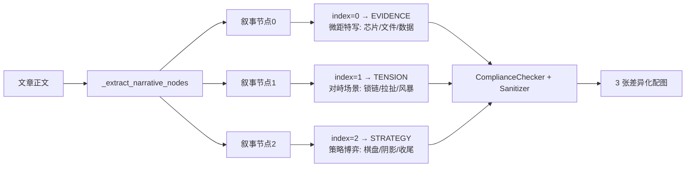

## 问题描述

images_clean 中 3 张内文配图高度雷同（全是"孤岛从迷雾中浮现"的变体），与旧版 images 中每张视觉独立的芯片/锁链/棋盘完全不同。需要修复让每张配图具有独特的视觉焦点。

## 根因定位

1. `_build_inline_visual_context(narrative_text)` 无 `index` 参数，3 张图走同一逻辑，无法做差异化选择
2. 文章每段都含"日本"，关键词匹配总命中 `_VISUAL_METAPHOR_MAP["日本"]` → `"a solitary island nation silhouette emerging from mist"`，导致3张图几乎一样
3. 抽象概念的逗号拼接（`"concept1, concept2, concept3"`）无法生成焦点明确的画面
4. 旧版用中文具象场景描述天然差异化，新版全转英文抽象化后丢失了场景多样性

## 修复目标

- 3 张内文配图视觉上明显不同，分别聚焦证据细节、张力对峙、策略博弈
- 保持英文 prompt + 禁文字指令（消除水印）
- 保持合规审查链完整

## 技术方案

### 总体策略：位置感知 + 三级差异化模板

核心思路：给 `_build_inline_visual_context` 注入 `index` 参数，让每张图对应文章叙事的不同阶段，使用不同的视觉焦点类别和专属 prompt 模板。



### 修改点 1：扩展 `_VISUAL_METAPHOR_MAP` 映射表

在现有映射表基础上增加三类具象场景关键词，避免总是命中"日本"：

**证据/细节类（index=0 优先）**：

- `"报告"` → `"a classified document under a magnifying glass, forensic examination"`
- `"拆解"` → `"disassembled precision components on an inspection table"`
- `"证据"` → `"photographic evidence pinned to an investigation board"`
- `"数据"` → `"glowing data streams flowing through a holographic display"`
- `"电子"` → `"a macro photograph of intricate circuit board pathways"`

**张力/对峙类（index=1 优先）**：

- `"对峙"` → `"two opposing chess pieces face to face across a divided board"`
- `"两难"` → `"a lone figure at a crossroads between two storm fronts"`
- `"进退"` → `"metallic chains pulling a structure in opposite directions"`
- `"矛盾"` → `"a cracked mirror reflecting two conflicting realities"`

**策略/博弈类（index=2 优先）**：

- `"幕后"` → `"shadowy hands hovering over a strategic map in a dim room"`
- `"棋局"` → `"an aerial view of a chess board mid-game with fallen pieces"`
- `"操纵"` → `"marionette strings attached to chess pieces from above"`
- `"收尾"` → `"a chapter-closing visual, a single piece tipping over on a board"`

### 修改点 2：替换 `_INLINE_TEMPLATE` 为三级独立模板

删除单一通用模板，改为 3 个位置专属模板：

```python
# index=0: 证据特写型 — 微距/放大镜/数据可视化
_INLINE_TEMPLATES = [
    "A macro editorial detail photograph of {scene}. Extreme close-up with shallow depth of field, professional forensic documentation aesthetic, cool blue-grey metallic tones, 8K quality",

    # index=1: 张力对峙型 — 冲突/拉扯/戏剧性
    "A dramatic cinematic wide shot of {scene}. Strong chiaroscuro lighting, opposing visual forces balanced in tension, amber and deep blue color clash, 8K editorial quality",

    # index=2: 策略博弈型 — 棋盘/阴影/收尾
    "An overhead editorial composition of {scene}. Top-down perspective with strategic arrangement, moody atmospheric lighting with highlights on key elements, dark elegant tones, 8K quality",
]
```

### 修改点 3：`_build_inline_visual_context` 增加 index 参数

```python
def _build_inline_visual_context(self, narrative_text: str, index: int) -> str:
```

核心逻辑：

1. 按 `index` 选择优先级类别（0→EVIDENCE 类关键词, 1→TENSION 类, 2→STRATEGY 类）
2. 在该类别中扫描 `narrative_text` 的关键词命中
3. 有命中则使用该类别的隐喻描述
4. 无命中则降级：先用对应类别默认回退场景，而不是全去匹配"日本"

**分类关键词集**：

```python
_CATEGORY_KEYWORDS = {
    0: ["报告", "拆解", "证据", "数据", "电子", "零件", "芯片", "曝光", "揭秘"],
    1: ["对峙", "两难", "进退", "矛盾", "困境", "冲突", "尴尬", "制裁"],
    2: ["幕后", "棋局", "操纵", "收尾", "博弈", "权力", "背后操纵", "野心"],
}
```

### 修改点 4：`build_inline_prompts` 传递 index

```python
for idx, point in enumerate(narrative_points):
    visual_context = self._build_inline_visual_context(point, idx)
    template = _INLINE_TEMPLATES[idx % 3]
    raw_prompt = template.format(scene=visual_context)
```

### 修改点 5：`compliance_checker.py` 微调

在 `_SAFE_ALTERNATIVES` 中确保以下科技词汇不被过度替换：

- `"chip"`, `"circuit"`, `"component"`, `"microchip"` 不在任何风险词库中（当前已正确，仅需确认）
- 新增 `"magnifying glass"`, `"forensic"`, `"document"` 等中性词到白名单保证不被误判
- `"drone"` 当前替换为 `"aerial vehicle"` — 对于新闻配图场景，"aerial vehicle" 已足够且安全，保持不变