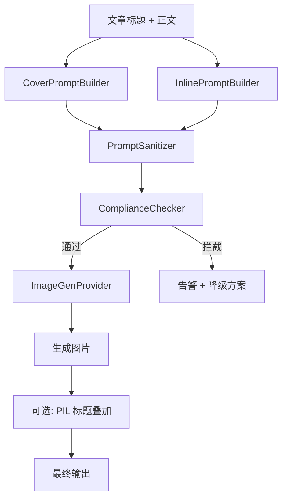

## 用户需求

对 AI 生成配图功能进行三项优化：

### 1. 彻底移除所有"AI 生成"等水印字样

当前 prompt 中的中文描述性文字（如"今日头条军事微头条封面图""评书故事风格""适合今日头条军事分析文章内文配图"）被 AI 模型渲染成了图片上的可见文字标签。需要确保所有生成图片干净无标记，不出现任何 prompt 文本被渲染到图片上的情况。

### 2. 封面图标题替换

封面 prompt 里默认的通用标签文字需要精确替换为当前文章的实际标题。但替换方式不是把标题文字直接写入 prompt（否则仍会被渲染），而是将标题转化为视觉概念描述融入 prompt。例如：文章标题"日本这回真偷鸡不成蚀把米"不是作为文字渲染，而是转化为"a broken samurai sword representing Japan's failed ambition, shattered pride"这样的视觉隐喻。

### 3. 遵守今日头条平台规范

生成图片时必须确保内容合规：

- 禁止武器公然展示（武士刀断裂虽为隐喻，但需审查"
锋利刀刃"等血//腥描述）
- 禁止暴力//场景和战争残骸特写
- 禁止敏感政治符号不当使用（国旗碎片、领导人形象）不触碰违规红线
- 需在 prompt 发送前进行自动合规审查，拦截风险词汇并告警

## 技术方案

### 整体架构



### 核心策略：三层清洗架构

**第一层 — PromptSanitizer（prompt 清洗器）**

- 剥离所有中文标签性文字（正则匹配中文开头/结尾的描述性短语）
- 统一转为纯英文视觉 prompt
- 强制追加 `DO NOT render any text, watermark, label, letters, or characters on the image. Pure visual scene only.` 指令
- 保留视觉描述语义完整

**第二层 — ComplianceChecker（合规审查器）**

- 维护敏感词库：武器血腥类（sword, blade, blood, weapon, explosion）、政治敏感类（flag fragment, leader silhouette）、战争恐怖类（wreckage, corpse, battlefield）
- 对 prompt 进行关键词扫描，匹配则拦截并告警
- 支持白名单放行（如"broken sword"作为抽象隐喻与"sharp blade cutting flesh"的区别）
- 拦截时生成降级方案：替换为中立视觉描述

**第三层 — CoverPromptBuilder（封面提示词构建器）**

- 输入：文章标题 + 正文摘要
- 使用 AIWriter 提取标题核心语义 → 转为视觉隐喻关键字
- 根据内容类型（军事/科技/时政）选择对应 prompt 模板（参考 cover-prompts.md）
- 模板格式：`A cinematic editorial composition of [visual_metaphor], [mood], [lighting], NO text, NO watermark, NO labels`

### 模块划分

#### 1. 新建 `wewrite-main/toolkit/prompt_sanitizer.py`

- `strip_chinese_labels(prompt: str) -> str`：正则剥离中文标签文字
- `to_english_prompt(prompt: str) -> str`：将中文描述转为英文
- `append_no_text_directive(prompt: str) -> str`：追加禁止渲染文字的强制指令
- `sanitize(prompt: str) -> str`：完整清洗管道

#### 2. 新建 `wewrite-main/toolkit/compliance_checker.py`

- `SENSITIVE_KEYWORDS` 配置字典，按严重等级分级
- `check(prompt: str) -> CheckResult`：扫描 prompt 返回合规结果
- `suggest_safe_alternative(original: str) -> str`：生成安全替代方案

#### 3. 新建 `wewrite-main/toolkit/cover_prompt_builder.py`

- `build_cover_prompt(title: str, summary: str, style: str) -> str`：构建封面 prompt
- `build_inline_prompt(narrative_point: str, index: int) -> str`：构建内文配图 prompt
- 复用 cover-prompts.md 的模板规范

#### 4. 修改 `d:/AIToutiao/toutiao-auto-publisher/backend/ai_writer.py`

- 新增 `generate_cover_image(title, content, output_path)` 方法
- 新增 `generate_inline_images(content, output_dir)` 方法
- 内部调用清洗器 + 审查器 + image_gen 模块

#### 5. 修改 `d:/AIToutiao/pipeline.py`

- `PipelineStage` 枚举新增 `GENERATE_IMAGES = "generate_images"`
- `PipelineMode` 的 `stages_for_mode` 在 WRITE 后插入图片生成阶段
- 新增 `ImageGenStage(StageRunner)` 类
- 新增 `--with-images` CLI 参数控制是否生成配图

### 技术约束与应对

| 约束 | 应对方案 |
| --- | --- |
| image_gen 无 watermark 参数 | 从 prompt 层面彻底解决，追加 `DO NOT render any text` 指令 |
| 标题不能直接写入 prompt | 将标题转为视觉隐喻描述，如"偷鸡不成蚀把米" → "a fox caught in its own trap" |
| Doubao/DashScope 已有 watermark:False | 保留，作为 API 层面的兜底 |
| cover-prompts.md 规范未落地 | 在 CoverPromptBuilder 中程序化执行其规则 |
| AI 可能仍渲染文字 | 双重保障：prompt 指令 + 合规检查后确认无风险 prompt 词汇 |


### 目录结构

```
d:/AIToutiao/
├── wewrite-main/toolkit/
│   ├── image_gen.py              # [已存在] 核心图片生成模块
│   ├── prompt_sanitizer.py       # [新建] Prompt 清洗器
│   ├── compliance_checker.py     # [新建] 合规审查器
│   └── cover_prompt_builder.py   # [新建] 封面提示词构建器
├── toutiao-auto-publisher/backend/
│   ├── ai_writer.py              # [修改] 新增 generate_cover_image() 和 generate_inline_images()
│   └── models.py                 # [可能修改] 如需要新增图片相关数据模型
├── pipeline.py                   # [修改] 新增 ImageGenStage + --with-images 参数
└── outputs/20260704/fresh_test_story_narrative/
    └── images/                   # [验证] 用清洗后的 prompt 重新生成干净图片
```

## 使用的 Agent 扩展

### Skill

- **多模态内容生成**
- 用途：在验证阶段使用其文生图片能力，用清洗后的 prompt 重新生成封面图和内文配图
- 预期结果：生成 4 张无中文标签、无 AI 水印、合规的干净图片，替换现有的脏图片

### SubAgent

- **code-explorer**
- 用途：在实施阶段探索 `image_gen.py` 各 provider 的具体参数和 `pipeline.py` 的 StageRunner 基类模式
- 预期结果：确认 provider 接口模式、StageRunner 基类继承约定，确保新模块与现有架构一致