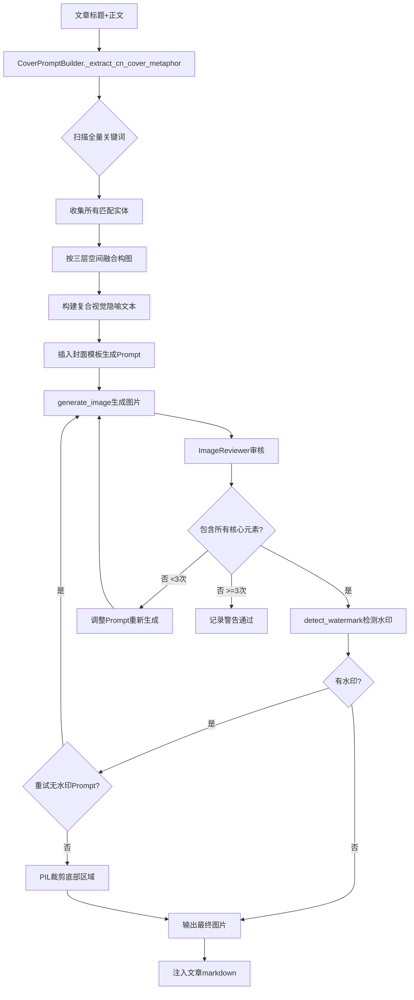

## 产品概述

对现有封面配图系统进行三项核心优化，提升封面图片的叙事完整性和输出质量管控。

## 核心功能

### 1. 封面多元素融合

当前封面 Prompt 仅匹配首个关键词（如"日本"），导致封面只反映单一维度（如断裂武士刀）。优化后，系统将扫描文章标题和正文中所有匹配的核心实体关键词（如日本、乌克兰、俄罗斯、芯片、无人机、制裁等），按"主体-中景-背景"三层空间结构构建复合视觉隐喻，将多方元素融合为一幅完整画面。例如：前景为主体（断裂武士刀+日本旗褪色），中景为军事芯片特写和无人机剪影，背景为暴风云层下一侧向日葵田（乌克兰）、一侧冰雪工业景观（俄罗斯）的冷暖对峙构图。

### 2. 图片审核与重试机制

新增 `image_reviewer.py` 审核模块，生成图片后自动调用智谱GLM-4V-Flash视觉模型校验图片是否包含 Prompt 中要求的核心元素。若不达标，自动调整 Prompt（增加强调指令）重新生成，最多重试3次。每次审核结果记录到日志。

### 3. 水印检测与裁剪去除

审核流程中增加水印检测步骤，识别图片中"AI生成"等文字水印。优先尝试重新生成（追加更强禁水印指令）；若仍无法消除，使用PIL针对图片底部区域（常见水印位置）进行智能裁剪排除。

## 技术栈

- **语言**：Python 3（与现有项目一致）
- **视觉审核**：智谱AI GLM-4V-Flash（`vision-tool/vision_tool.py` 已有封装）
- **图片处理**：PIL/Pillow（`image_gen.py` 已使用）
- **Prompt构建**：现有 `CoverPromptBuilder` 类扩展

## 实现方案

### 架构设计

### 模块划分

#### 模块1：封面Prompt多元素融合（`cover_prompt_builder.py`）

- **修改 `_extract_cn_cover_metaphor()`**：从"取单一最长匹配"改为"收集全部匹配实体+按空间层融合"
- **新增 `_fuse_multi_element_metaphor()`**：接收实体列表，按前景/中景/背景三层空间布局生成复合视觉描述
- **新增 `_STYLE_TEMPLATES_CN["story_narrative"]` 多元素版**：模板使用 `{foreground} / {midground} / {background}` 三层占位符
- **扩展 `_CN_COVER_VISUAL_MAP`**：新增"导弹""制裁""供应链""证据"等实体的简短视觉片段

#### 模块2：图片审核器（`wewrite-main/toolkit/image_reviewer.py`，新建）

- **`review_image(image_path, expected_elements, max_retries=3)`**：

1. 调用 `vision_tool._analyze()` 传入自定义检查prompt（列出所有期望元素）
2. 解析返回结果判断是否全部包含
3. 返回 `(pass, missing_elements, suggestion)`

- **`detect_watermark(image_path)`**：

1. 调用 `vision_tool.ocr()` 提取图片文字
2. 匹配"AIGC""AI生成""由AI"等关键词
3. 返回 `(has_watermark, watermark_text)`

- **`crop_watermark(image_path, crop_ratio=0.06)`**：

1. 使用PIL打开图片
2. 裁剪底部6%（常见水印区域）
3. 覆盖保存

#### 模块3：管线集成（`ai_writer.py` + `pipeline.py`）

- **`ai_writer.py` 修改 `generate_cover_image()`**：

1. Prompt构建后提取期望元素列表（`result["expected_elements"]`）
2. 调用 `generate_image()` 生成
3. 循环调用 `image_reviewer.review_image()` 审核
4. 不通过则调用 `_adjust_prompt_for_retry()` 强化缺失元素
5. 最多重试3次
6. 最终调用 `detect_watermark()` + `crop_watermark()`

- **`pipeline.py` 修改 `ImageGenStage`**：日志输出审核结果和重试次数

### 数据流

1. **输入**：`title` (str) + `content` (str)
2. **多元素提取**：`_extract_cn_cover_metaphor(title, content)` → `(fused_metaphor, element_list)`
3. **Prompt构建**：`template.format(foreground=..., midground=..., background=...)` → `prompt`
4. **图片生成**：`generate_image(prompt, ...)` → `image_path`
5. **审核循环**：`review_image(image_path, element_list)` → `(pass/fail)`
6. **重试调整**：`_adjust_prompt_for_retry(prompt, missing)` → `adjusted_prompt`
7. **水印处理**：`detect_watermark` → `crop_watermark` (if needed)
8. **输出**：最终图片路径 + 审核日志

### 关键设计决策

1. **多层融合而非简单拼接**：不使用"元素A和元素B同框"的粗糙拼接，而是按前景/中景/背景的空间层次分别描述，让AI模型自行构建有景深的复合画面。
2. **审核使用智谱免费API**：避免额外成本，`vision_tool.py` 已封装好，直接导入 `_analyze()` 即可。
3. **水印先尝试Prompt解决再裁剪**：优先尊重图片完整性，裁切作为兜底（仅裁6%底部，损失可控）。
4. **保持向后兼容**：单元素匹配场景（文章只涉及1个核心实体）自动走原逻辑，不影响现有输出。

### 性能考虑

- 智谱视觉API单次调用约2-5秒，审核+水印检测最多4次调用/图
- 重试最多3次意味着最坏情况：3次生成 + 4次审核 = 约30-60秒
- 内文配图不受影响（仅封面启用多元素融合和审核）

### 日志与可观测性

- 审核结果（pass/fail + missing elements）写入 `image_review_log.md`
- 重试次数、水印检测结果跟随Pipeline日志输出
- 所有审核prompt和response均记录，便于调试

## Agent Extensions

### Skill

- **多模态内容生成**
- 用途：在开发调试阶段，使用 `image_gen` 验证多元素融合Prompt的实际生成效果
- 预期结果：确认融合Prompt能生成包含日本/乌克兰/俄罗斯/芯片等元素的高质量封面图

### SubAgent

- **code-explorer**
- 用途：在实现阶段快速搜索和理解 `cover_prompt_builder.py`、`image_gen.py`、`ai_writer.py` 的完整上下文和调用关系
- 预期结果：准确定位所有需要修改的代码位置和接口约定