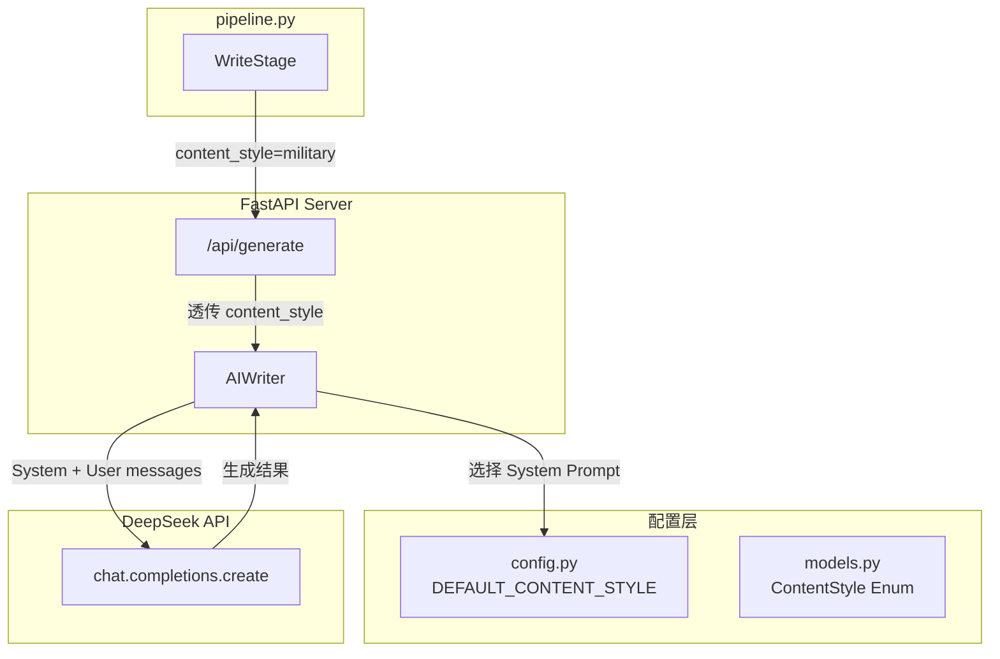

## 用户需求

基于现有文章 `微头条_20260704_131106.md` 进行分析，为军事微头条账号定制一套专属 DeepSeek AI 写作风格体系。

## 核心要求

1. **风格提炼**：从已有文章中提炼独特的个人写作风格与叙事口吻，确保文章有鲜明个人印记，提升粉丝黏性与期待感
2. **军事真实**：严格遵守军事领域的真实性原则，绝不歪曲历史与军事事实
3. **国家立场**：坚定维护国家立场，绝不允许任何抹黑国家的倾向
4. **标准化输出**：输出一套标准化的风格指令与写作技巧模板，使后续所有微头条文章均严格遵循此专属风格生成

## 技术实现范围

将风格体系集成到 DeepSeek API 调用链路中，涉及 `ai_writer.py`、`models.py`、`config.py`、`main.py`、`pipeline.py` 五个文件的修改，使流水线调用 `/api/generate` 时自动启用军事专属风格。

## 技术栈

- **语言**：Python 3.12
- **AI SDK**：openai Python SDK（兼容 DeepSeek API）
- **模型**：deepseek-chat
- **Web 框架**：FastAPI + Pydantic v2
- **配置管理**：pydantic-settings

## 实现方案

### 整体策略

将当前的单一 `TOUTIE_PROMPT`（通用 user prompt）升级为「System Prompt + User Prompt」双层结构。System Prompt 负责固化账号人设、军事写作规范、内容红线和风格约束；User Prompt 负责传递具体转录文本和字数要求。通过 `content_style` 参数区分军事风格与通用风格，保持向后兼容。

### 关键设计决策

1. **System Prompt 而非扩展 User Prompt**：System Prompt 在 DeepSeek API 中享有更高权重，更适合固化角色人设和风格规范，不会被后续对话稀释。当前代码未使用 System Prompt，本次新增不破坏现有逻辑。

2. **content_style 枚举而非硬编码**：通过 `ContentStyle` 枚举（military/general）区分风格，pipeline 传 `military`，Web UI 可保持 `general` 默认值，支持未来扩展更多风格（如财经、科技）。

3. **风格指令内嵌于代码而非外部文件**：军事风格 Prompt 作为代码常量定义在 `ai_writer.py` 中，与通用 `TOUTIE_PROMPT` 共存，便于版本管理和 CI/CD。

### 性能与可靠性

- **额外 Token 开销**：System Prompt 约 800-1200 tokens，每次请求增加约 2-3 秒，不影响流水线整体时效（当前 AI 改写耗时 11 秒，增加后约 14 秒）
- **向后兼容**：`content_style` 默认值为 `general`，不传时使用通用 TOUTIE_PROMPT，现有 Web UI 和 pipeline 行为不变
- **温度调整**：军事风格 temperature 建议保持 0.7，兼顾创意与事实一致性

## 架构设计



### 数据流

1. `pipeline.py` WriteStage 在 `/api/generate` 请求 body 中新增 `content_style: "military"`
2. `main.py` 将 `content_style` 透传给 `AIWriter.generate()`
3. `AIWriter._call_ai()` 根据 `content_style` 选择对应的 System Prompt，构建 `[system, user]` messages 数组
4. DeepSeek 接收到 System + User 消息，按军事风格生成微头条

## 目录结构

```
d:/AIToutiao/toutiao-auto-publisher/backend/
├── ai_writer.py          # [MODIFY] 新增 System Prompt 支持、军事风格 Prompt 常量、_call_ai 改造
├── models.py             # [MODIFY] 新增 ContentStyle 枚举、GenerateRequest 新增 content_style 字段
├── config.py             # [MODIFY] 新增 DEFAULT_CONTENT_STYLE 配置项
├── main.py               # [MODIFY] /api/generate 透传 content_style 到 AIWriter.generate()
d:/AIToutiao/
├── pipeline.py           # [MODIFY] WriteStage 调用 /api/generate 时传入 content_style="military"
```

## 关键代码结构

### ContentStyle 枚举（models.py 新增）

```python
class ContentStyle(str, Enum):
    GENERAL = "general"       # 通用风格（原有 TOUTIE_PROMPT）
    MILITARY = "military"     # 军事专属风格（新增 SYSTEM_PROMPT_MILITARY）
```

### GenerateRequest 扩展（models.py）

```python
class GenerateRequest(BaseModel):
    topic: str
    content_type: ContentType = ContentType.ARTICLE
    max_chars: Optional[int] = Field(None)
    tone: str = Field("专业且易懂")
    content_style: ContentStyle = Field(ContentStyle.GENERAL, description="内容风格（military/general）")
    include_title: bool = True
```

### AIWriter._call_ai 改造（ai_writer.py）

```python
def _call_ai(self, prompt: str, system_prompt: str = None, max_tokens: int = None) -> str:
    messages = []
    if system_prompt:
        messages.append({"role": "system", "content": system_prompt})
    messages.append({"role": "user", "content": prompt})
    response = self.client.chat.completions.create(
        model=self.model,
        messages=messages,
        max_tokens=max_tokens or settings.AI_MAX_TOKENS,
        temperature=settings.AI_TEMPERATURE,
    )
    return response.choices[0].message.content.strip()
```