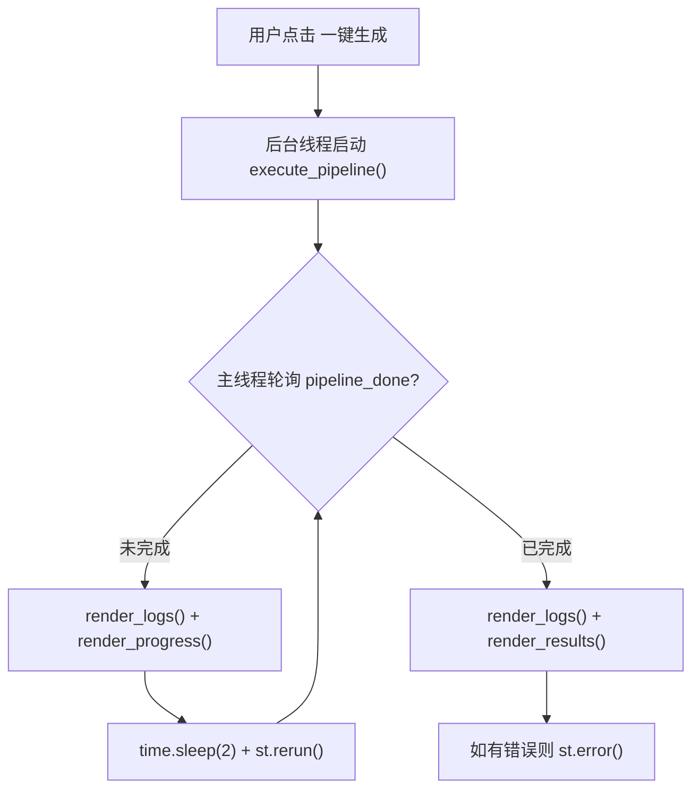

## 用户需求

用户反馈了 3 个问题需要解决：

1. **批处理启动乱码**：`run_engine.bat` 使用 `chcp 65001` 设置 UTF-8 编码后仍然无法正确渲染 `╔╗╚╝` 等 Unicode 框线字符，导致 CMD 报 `'is not recognized as an internal or external command'` 错误。

2. **网页无实时日志**：点击"一键生成"后网页只显示一条静止的"流水线执行中，请稍候..."提示，整个流水线执行期间（下载、转录、写作、配图、组装，共 5 个阶段，可能耗时数分钟到十几分钟）网页上完全看不到任何实时日志输出，用户只能盯着空白页面等待。

3. **转录阶段静默无输出**：切换到 transformers 后端后（因 faster-whisper 未安装），`pipe()` 调用是同步阻塞的 CPU 推理，可能需要 2-10 分钟，期间完全没有任何日志输出，用户误以为程序卡死。

用户明确要求：**CMD 终端的日志可以不要，但网页上的日志必须详细实时显示**。

## 核心功能

- **后台线程执行流水线**：将 `execute_pipeline()` 从主线程同步阻塞改为后台线程异步执行，主线程保持响应
- **网页实时日志刷新**：通过 `st.rerun()` 轮询机制，每隔约 2 秒刷新页面显示最新日志和进度
- **转录阶段进度提示**：在长时间静默操作（如 `pipe()` 调用）前后添加 `add_log()` 提示
- **批处理文件兼容性修复**：将 Unicode 框线字符替换为 ASCII 等号分隔线

## 技术栈

- 前端框架：Streamlit（已有）
- 后端语言：Python 3（已有）
- 线程机制：`threading.Thread` + `add_script_run_ctx`
- 文件编码：UTF-8（已有 `chcp 65001`）

## 实现方案

### 整体策略：后台线程 + 轮询刷新

核心思路是将 `execute_pipeline()` 从主线程移到一个 daemon 线程中执行，主线程通过轮询 `st.session_state.pipeline_done` 标志位来决定是继续等待还是展示结果。



### 关键决策：使用 `add_script_run_ctx` 而非队列模式

**决策依据**：Streamlit 官方文档规定 `st.session_state` 只能在脚本线程中安全调用。有两种绕过方式：

| 方案 | 改动点 | 风险 |
| --- | --- | --- |
| 队列模式（推荐） | 需要重构 `execute_pipeline()` 内约 50+ 处 `add_log()`/`set_stage()` 调用点 | 改动面大，易遗漏 |
| `add_script_run_ctx`（非官方） | 只需在 `main()` 中添加 3 行导入 + 1 行注入 | 改动最小，社区广泛使用 |


**选择 `add_script_run_ctx` 的原因**：

- `add_log()` 在 `execute_pipeline()` 内部被调用约 50+ 次，分散在 `step_download()`、`step_transcribe()`、`_research_and_write()`、`step_images()`、`step_assemble()` 等 6 个阶段函数中
- 队列方案需要重构所有这些调用点，引入 `queue.Queue` 作为中间层，改动面巨大且风险高
- `add_script_run_ctx` 只需改动 `main()` 函数本身，不影响流水线内部的任何代码
- 该模式在 Streamlit 社区已被广泛验证（参见官方文档 `develop/concepts/design/multithreading`）

### 风险缓解

- **重复触发防护**：`st.button()` 只在被点击的那一次返回 `True`，`st.rerun()` 后续执行中 `generate_btn` 为 `False`，不会重复启动线程
- **互斥锁**：`st.session_state.is_running` 作为互斥标志，确保同一时间只有一个后台线程在运行
- **线程生命周期**：daemon 线程随主进程退出自动清理，不会残留僵尸线程
- **finally 保证**：`execute_pipeline()` 的 `finally` 块确保 `pipeline_done` 一定被设为 `True`，避免永久轮询
- **异常兜底**：`BaseException` 捕获（含 `SystemExit`/`KeyboardInterrupt`）确保致命异常不会导致线程静默死亡

## 架构设计

### 数据流

```
后台线程                           主线程
─────────                         ────────
execute_pipeline()
  ├─ add_log("开始下载...")  ──→  st.session_state.logs
  ├─ set_stage("下载","running")→  st.session_state.stage_status
  ├─ step_download()              ...
  ├─ add_log("下载完成")     ──→  st.session_state.logs
  ├─ step_transcribe()            ...
  │   ├─ add_log("正在转录...")→  st.session_state.logs  ←── render_logs() 读取
  │   └─ pipe() ← 静默阻塞            ...
  ├─ _research_and_write()        ...
  ├─ step_images()                ...
  ├─ step_assemble()              ...
  └─ finally:                     pipeline_done = True ←── main() 检测到，停止轮询
      pipeline_done = True             渲染最终结果
```

## 实现细节

### 修改 1：`main()` 重构（核心改动）

**文件**：`d:\AIToutiao\engine_mode\engine_app.py`，第 2464-2517 行

**改动内容**：

1. 在文件顶部 `import` 区（第 21-22 行附近）添加 `import threading` 和 `from streamlit.runtime.scriptrunner import add_script_run_ctx, get_script_run_ctx`
2. 将第 2472-2501 行的 `if generate_btn and url.strip():` 块重构为：

- 如果点击按钮且未在运行：启动后台线程，用 `add_script_run_ctx` 注入上下文
- 如果正在运行且未完成：渲染日志和进度，`time.sleep(2)`，`st.rerun()` 刷新
- 如果已完成：渲染日志、进度和结果，展示错误信息

**轮询间隔**：2 秒（平衡实时性和 CPU 开销）

### 修改 2：转录阶段添加进度提示

**文件**：`d:\AIToutiao\engine_mode\engine_app.py`，第 753-802 行

在 `_transcribe_transformers()` 函数的 `pipe()` 调用（第 774 行）前后添加 `add_log()`：

- 调用前：`add_log("正在转录音频（CPU 推理中，请耐心等待……）", "info")`
- 调用后：`add_log("语音识别完成，正在处理文本……", "info")`

### 修改 3：批处理文件框线字符修复

**文件**：`d:\AIToutiao\engine_mode\run_engine.bat`

将第 5-8 行的 Unicode 框线字符替换为 ASCII 等号分隔线。

## 目录结构

```
engine_mode/
├── engine_app.py          # [MODIFY] 第 21-22 行添加导入，第 753-802 行添加转录提示，第 2464-2517 行重构 main()
└── run_engine.bat         # [MODIFY] 第 5-8 行框线字符改为 ASCII
```

## 关键代码结构

### main() 重构后的伪代码结构

```python
def main():
    style, content_type, humanize, with_images = render_sidebar()
    url, generate_btn = render_main()

    # ── 情况 1：用户点击按钮，启动后台线程 ──
    if generate_btn and url.strip() and not st.session_state.is_running:
        processed = st.session_state.get("processed_url", "")
        if not processed:
            st.error("未找到有效链接")
        else:
            st.session_state.is_running = True
            st.session_state.pipeline_done = False
            st.session_state.pipeline_error = None
            st.session_state.logs = []
            
            def _run():
                try:
                    execute_pipeline(processed, style, humanize, with_images, content_type)
                except BaseException as e:
                    st.session_state.pipeline_error = str(e)
            
            thread = threading.Thread(target=_run, daemon=True)
            add_script_run_ctx(thread, get_script_run_ctx())
            thread.start()

    # ── 情况 2：后台线程运行中，轮询刷新 ──
    if st.session_state.is_running and not st.session_state.pipeline_done:
        render_progress()
        render_logs()
        time.sleep(2)
        st.rerun()

    # ── 情况 3：流水线完成 ──
    if st.session_state.pipeline_done or not st.session_state.is_running:
        render_progress()
        render_logs()
        render_results()
        if st.session_state.pipeline_error:
            st.error(f"流水线执行异常: {st.session_state.pipeline_error}")
```

### 兼容性说明

- `execute_pipeline()` 内部代码完全不变（包括 `add_log()`、`set_stage()`、`st.session_state` 写入等）
- `render_progress()`、`render_logs()`、`render_results()` 完全不变
- 所有已有的 6 个阶段函数完全不变
- `PipelineState`、`_build_result()` 完全不变