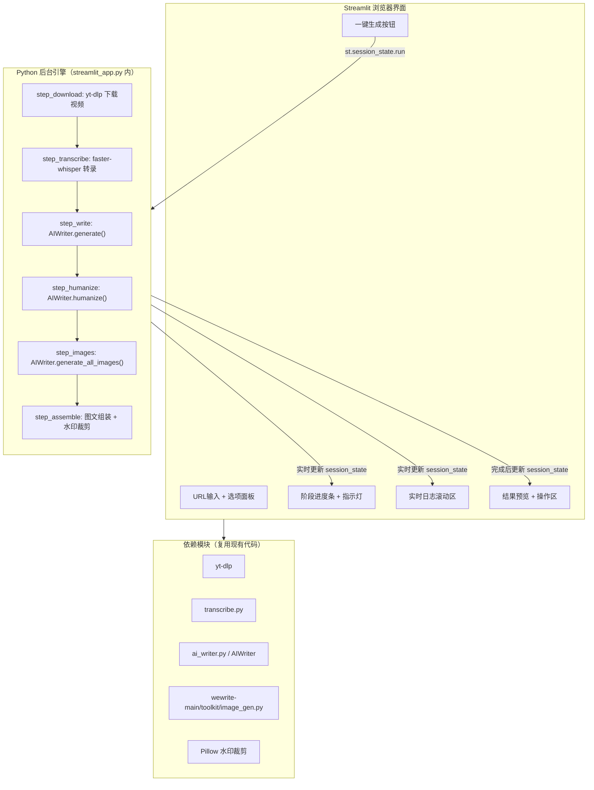

## 用户需求

开发一个基于 Streamlit 框架的一键式内容生成 Web 应用，封装 AIToutiao 现有工作流。用户双击 `run.bat` 启动后，浏览器自动打开操作界面，仅需输入抖音链接并点击"一键生成"，程序即可在后台自动完成完整流程。

## 产品概述

AIToutiao Streamlit 应用将现有的命令行流水线改造为可视化的 Web 交互界面。用户可在浏览器中粘贴抖音链接、选择内容风格和开关选项，点击按钮后看到实时进度条、阶段指示灯和滚动日志，完成后可预览生成稿件并一键打开输出目录。

## 核心功能

1. **链接输入区**：粘贴抖音短视频分享链接，附带历史运行检测提示
2. **一键生成按钮**：触发完整流水线（下载→转录→AI写作→人工化改写→配图生成→图文组装）
3. **选项配置**：内容风格下拉选择（6种军事微头条风格 + 通用风格）、内容类型切换（微头条/文章）、人工化改写开关、AI配图开关
4. **实时进度反馈**：阶段进度条（6个阶段指示灯）、当前阶段描述文字、实时滚动的运行日志区域
5. **结果展示**：生成完成后展示封面图、文章/微头条全文 Markdown 渲染、文件清单和字符统计
6. **输出管理**：一键打开输出目录、查看原始 AI 版本对比、复制稿件内容
7. **设置面板**：侧边栏配置 API Key 等敏感信息，持久化到 .env 文件

## 技术栈选型

| 层 | 技术 | 理由 |
| --- | --- | --- |
| **Web 框架** | Streamlit 1.x | 纯 Python 编写，内置 st.progress/st.spinner 组件，无需前端开发 |
| **视频下载** | yt-dlp (Python库) | 替代现有 Node.js download.mjs，支持抖音，可打包进 venv |
| **语音转录** | 复用 transcribe.py (faster-whisper) | 现有代码成熟，支持多后端回退 |
| **AI 写作** | 直接实例化 AIWriter | 绕过 toutiao-auto-publisher HTTP API，减少服务依赖 |
| **配图生成** | 复用 wewrite-main/toolkit/image_gen.py | 支持多提供商（doubao/dashscope/openai等），从 config.yaml 读取密钥 |
| **图片处理** | Pillow | 水印裁剪 |
| **配置管理** | python-dotenv + pydantic-settings | 从根目录 .env 加载，Streamlit 侧边栏设置面板写入 |
| **启动器** | run.bat (批处理) | 双击启动 `streamlit run app.py` 并自动打开浏览器 |


## 实现方案

### 整体策略：单文件 Streamlit 应用，通过模块化函数编排流水线

整个 Streamlit 应用作为独立 Python 脚本 `streamlit_app.py` 放置在项目根目录。应用内部将现有流水线的各阶段重构为独立函数，使用 Streamlit 的 session_state 管理运行状态，通过 `st.progress` 和自定义日志容器实现实时反馈。

**为什么不拆分为多文件**：Streamlit 应用脚本型特点决定单文件更易部署维护，所有阶段函数在文件内定义，通过条件渲染实现页面分区。

### 运行时架构



### 流程阶段编排（在 streamlit_app.py 中）

```
阶段 1/6: 视频下载     (yt-dlp 下载抖音视频 → .temp/*.mp4)
阶段 2/6: 语音转录     (faster-whisper 转录 → transcript.txt)
阶段 3/6: AI 写作      (AIWriter.generate() → 微头条_xxx.md)
阶段 4/6: 人工化改写   (AIWriter.humanize() → 微头条_xxx.md 覆写)
阶段 5/6: 配图生成     (AIWriter.generate_all_images() → images/cover.png + 3 inline)
阶段 6/6: 图文组装     (将图片引用插入文章 + PIL 裁剪水印 → 完整稿件_配图版.md)
```

每个阶段的执行由 `execute_pipeline()` 函数按序调度，执行结果实时写入 `st.session_state.logs` 列表和 `st.session_state.progress` 百分比，触发 Streamlit 重新渲染。

### 状态管理

复用现有 `pipeline.py` 中的 `PipelineState` 类，支持：

- **断点续跑**：如果 URL 已有未完成的运行记录，自动恢复并从上次中断处继续
- **去重**：如果 URL 已有完整运行记录，提示用户可直接查看结果
- **持久化**：每完成一个阶段，自动保存 `pipeline_state.json`

### 关键改造点

1. **视频下载**：不再调用 `subprocess.run(["node", "download.mjs", ...])`，改为直接 `import yt_dlp` 调用其 Python API，视频保存到 `run_dir/.temp/` 目录
2. **AI 写作**：不再通过 `requests.post(f"{PUBLISH_API_BASE}/api/generate", ...)` 调用，改为直接 `from ai_writer import AIWriter; writer = AIWriter(); result = writer.generate(...)`
3. **图片生成**：由于 CodeBuddy 的 `image_gen` 工具仅在 IDE 内可用，应用需检查 `image_gen.py` API 是否已配置（doubao/dashscope/openai），如未配置则在日志中提示并在 UI 显示警告

## 目录结构

```
d:\AIToutiao\
├── streamlit_app.py              # [NEW] 主应用入口（约 500 行）
│   # 包含完整的 Streamlit 页面定义、7个阶段函数、日志管理、状态管理。
│   # 页面分三个区域：侧边栏选项 + 主区域进度/日志 + 底部结果展示。
│   # 使用 st.session_state 管理 logs/progress/stage/pipeline_state/result_data。
│   # 复用现有模块：PipelineState、AIWriter、transcribe.transcribe()、
│   #   CoverPromptBuilder、image_gen.generate_image()、PIL Image
├── run.bat                        # [NEW] 启动批处理文件
│   # 内容：激活 venv（如存在）、安装 streamlit（如缺失）、
│   #   执行 streamlit run streamlit_app.py --server.port 8501
├── .env                           # [EXISTING] 复用现有配置，追加 STREAMLIT_* 配置项
├── pipeline.py                    # [EXISTING] 保留原 CLI 流水线，不修改
├── transcribe.py                  # [EXISTING] 复用转录后端
├── toutiao-auto-publisher/backend/
│   ├── ai_writer.py               # [EXISTING] 复用 AIWriter 类
│   ├── models.py                  # [EXISTING] 复用 ContentType/ContentStyle 枚举
│   └── config.py                  # [EXISTING] 复用 Settings 配置
├── wewrite-main/toolkit/
│   ├── image_gen.py               # [EXISTING] 复用 generate_image()
│   ├── cover_prompt_builder.py   # [EXISTING] 复用 CoverPromptBuilder
│   ├── prompt_sanitizer.py        # [EXISTING] 复用 PromptSanitizer
│   ├── compliance_checker.py      # [EXISTING] 复用 ComplianceChecker
│   └── image_reviewer.py          # [EXISTING] 复用 review_image()/detect_watermark()/crop_watermark()
└── outputs/                       # [EXISTING] 复用输出目录结构
```

## 关键代码结构

### streamlit_app.py 核心结构

```python
import streamlit as st
import sys
from pathlib import Path
from datetime import datetime

# ── 路径初始化 ──
PROJECT_ROOT = Path(__file__).parent
sys.path.insert(0, str(PROJECT_ROOT / "toutiao-auto-publisher" / "backend"))
sys.path.insert(0, str(PROJECT_ROOT / "wewrite-main" / "toolkit"))
OUTPUTS_DIR = PROJECT_ROOT / "outputs"

# ── 页面配置 ──
st.set_page_config(page_title="AIToutiao 一键生成", layout="wide")

# ── session_state 初始化 ──
# logs: List[str] — 运行日志行
# progress: float (0.0~1.0) — 整体进度
# current_stage: str — 当前阶段名称
# stage_status: dict[str, str] — {"下载":"done","转录":"running","写作":"pending",...}
# pipeline_state: PipelineState — 流水线状态
# result_data: dict — 完成后填充的结果数据

# ── 阶段函数（各返回 bool） ──
def step_download(url: str, run_dir: Path) -> bool: ...
def step_transcribe(video_path: str, run_dir: Path) -> bool: ...
def step_write(state, transcript: str) -> bool: ...
def step_humanize(state) -> bool: ...
def step_images(state) -> bool: ...
def step_assemble(state) -> bool: ...

# ── 流水线调度 ──
def execute_pipeline(url: str, style: str, enable_humanize: bool, 
                     with_images: bool, content_type: str) -> dict: ...

# ── UI 布局 ──
# 侧边栏：风格选择、开关、API Key 设置
# 主区域 cols[0]: URL 输入 + 进度 + 日志
# 主区域 cols[1]: 操作按钮 + 结果预览
```

### PipelineState 关键属性（复用已有类）

```python
class PipelineState:
    run_id: str          # 如 "20260705_164001"
    input_url: str       # 用户输入的抖音链接
    content_type: str    # "toutie" 或 "article"
    enable_humanize: bool
    with_images: bool
    completed_stages: List[str]  # ["download","transcribe","write",...]
    outputs: Dict[str, Any]      # {"video_files":[...], "transcript_text":"...", ...}
    
    @property
    def run_dir(self) -> Path: ...       # outputs/20260705/20260705_164001/
    def is_stage_done(self, stage) -> bool: ...
    def mark_done(self, stage): ...
    def save(self): ...                  # 持久化到 pipeline_state.json
    @classmethod
    def load(cls, run_id) -> "PipelineState": ...
    @classmethod
    def find_existing(cls, url) -> Optional["PipelineState"]: ...
```

### ContentStyle 枚举（内置 7 种风格）

```python
class ContentStyle(str, Enum):
    GENERAL = "general"                   # 通用风格
    MILITARY = "military"                 # 军事深度分析型（七层递进）
    STORY_NARRATIVE = "story_narrative"   # 评书故事型（听风的蚕）
    SHARP_COMMENTARY = "sharp_commentary" # 冷静克制型（牛弹琴）
    DATA_LIST = "data_list"               # 硬核论证型（静思有我）
    FLASH_NEWS = "flash_news"             # 快讯速报型
    DISCUSSION = "discussion"             # 互动讨论型
```

## 实现注意事项

### 性能

- 转录阶段（faster-whisper small 模型）是瓶颈，对 3 分钟视频约需 30-90 秒（CPU）。前端通过 st.spinner 和日志实时反馈，避免用户感知"卡死"
- 每个阶段结果即时保存到磁盘，即使后续阶段失败也不会丢失已完成的工作
- 图片生成阶段 4 张图并发请求（取决于 API 提供商支持）

### 日志

- 日志格式：`[HH:MM:SS] [阶段名] 消息内容`，用不同 emoji 区分级别（✅ 成功 / ❌ 失败 / ⚠ 警告 / 📝 信息 / ⏳ 等待中）
- 限制日志行数最多 200 行，超出自动裁剪头部

### 容错

- yt-dlp 下载失败时自动降级到"手动输入文本"模式，用户可直接粘贴视频文案跳过下载+转录阶段
- 转录失败时自动从 yt-dlp 的 description 字段提取文本作为兜底
- 配图 API 未配置时跳过图片生成阶段，仅输出纯文本文稿
- 每个异常都捕获并记录到日志，不中断流水线（除 AI 写作失败外，写作失败则终止）

### 兼容性

- 保留现有 `pipeline.py` CLI 入口不变，Streamlit 应用作为增强界面并行存在
- 输出目录结构 100% 兼容现有格式（outputs/date/run_id/...）

## 设计风格

采用 **暗色军事风** 主题，深色背景搭配高对比度亮色文字，营造专业深度分析氛围。界面布局为三栏式宽屏设计：左侧边栏为选项配置区、中央主区域为进度与监控区、底部为结果展示区。

## 页面规划

单页应用，分为以下功能区块（从上到下）：

### 1. 顶部标题栏

深色背景，左侧显示应用名称"AIToutiao 一键内容生成器"和版本号，右侧显示当前运行状态指示灯（●绿色就绪 / ●黄色运行中 / ●红色出错）。

### 2. 主操作区（中央栏）

- **URL 输入框**：大号圆角输入框，placeholder 提示"粘贴抖音链接..."
- **一键生成按钮**：主色调大按钮，默认橙色，运行中变灰并显示旋转动画
- **阶段进度条**：6 个圆形指示灯横向排列，每个下方标注阶段名（下载/转录/写作/改写/配图/组装），已完成绿色、进行中蓝色脉冲、待处理灰色
- **运行日志区**：深色终端风格滚动区域，等宽字体，自动滚动到底部，不同级别用不同颜色标识

### 3. 侧边栏（左侧）

- **内容风格**：下拉选择框，7 个选项
- **内容类型**：微头条/文章 切换
- **人工化改写**：开关 toggle
- **AI 配图生成**：开关 toggle（带提示"需配置图片 API Key"）
- **分隔线**
- **API 密钥设置**：可折叠面板，输入框类型为 password

### 4. 结果展示区（页面底部，完成后出现）

- **封面图预览**：居中展示，最大宽度 400px，圆角阴影
- **稿件全文**：Markdown 渲染的完整文章，可滚动
- **文件清单**：文件路径 + 文件大小
- **操作按钮组**：打开输出目录 / 复制稿件 / 下载 Markdown

### 5. 状态栏（页面最底部）

显示当前 Run ID 和耗时统计

## 推荐的 Agent 扩展

### SubAgent

- **code-explorer**
- 用途：在实现过程中探索现有代码的具体 API 签名、类方法参数、配置文件格式等细节，确保 streamlit_app.py 中调用的每个函数签名和返回值类型与现有代码完全匹配
- 预期结果：获取 AIWriter.generate()、AIWriter.humanize()、AIWriter.generate_all_images()、transcribe()、CoverPromptBuilder.build_all()、image_gen.generate_image() 等关键函数的精确签名和参数格式