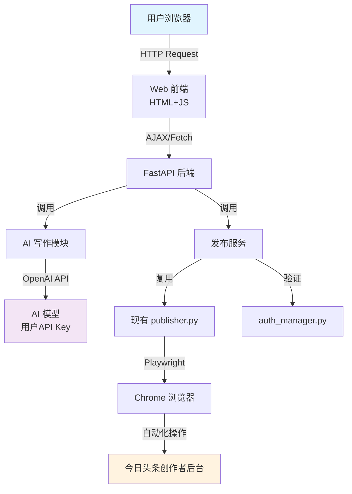

## 产品概述

开发今日头条自动化写作与发布工具，用户通过 Web 界面输入主题或关键词，系统自动生成符合微头条和文章格式的内容，并通过 Playwright 浏览器自动化完成今日头条创作者后台的一键发布。

## 核心功能

- **AI 内容生成**：接入用户已有 API Key（OpenAI 兼容接口），根据主题/关键词自动生成微头条（200-1000字，轻松随意风格）和文章（1000-5000字，结构完整）
- **浏览器自动化发布**：基于现有成熟代码，通过 Playwright 控制 Chrome 浏览器，自动完成登录状态检测、内容填充、封面设置、点击发布全流程
- **Cookie 持久化登录**：复用现有 auth_manager 模块，支持扫码登录一次后长期有效，自动检测登录状态失效并提示重新登录
- **Web 管理界面**：简洁的单页面操作界面，支持内容类型选择、主题输入、生成预览、一键发布、任务状态查看
- **异常处理机制**：页面元素加载验证、发布失败自动重试、详细的操作日志输出

## 技术栈选择

- **后端框架**：Python FastAPI（轻量、高性能、自带 API 文档）
- **前端方案**：HTML + Tailwind CSS + Vanilla JavaScript（简单直接，无需构建工具）
- **浏览器自动化**：Playwright for Python（复用现有 patchright 代码，patchright 是 playwright 的分支）
- **AI 接口**：OpenAI Python SDK（兼容所有 OpenAI 协议的服务，如 DeepSeek、通义千问等）
- **数据持久化**：JSON 文件存储（任务记录、配置信息，简单有效）

## 实施方法

整体采用**分层架构**，在现有 `super-publisher-main/skills/toutiao-publisher/scripts/` 的成熟代码基础上进行增强：

1. **AI 写作模块（新增）**：独立封装 `ai_writer.py`，使用 Jinja2 风格的 Prompt 模板，支持微头条和文章两种 Prompt，调用 OpenAI 兼容接口生成内容
2. **发布服务模块（复用+封装）**：将现有 `publisher.py` 的核心逻辑封装为可调用服务类，支持从后端 API 直接调用，避免 CLI 参数解析
3. **FastAPI 后端（新增）**：提供 RESTful API，包括内容生成接口、发布接口、登录状态查询接口、任务状态接口
4. **Web 前端（新增）**：单页面应用，通过 AJAX 调用后端 API，实时展示任务进度

**关键决策理由**：

- 复用现有 Playwright 代码而非重写：现有 `publisher.py` 已处理 ProseMirror 编辑器注入、封面上传、发布按钮点击等复杂场景，代码经过实战验证
- 使用 patchright 而非原生 playwright：现有代码使用 `patchright.sync_api`，这是 playwright 的反爬虫增强版，必须保持一致
- JSON 文件存储而非数据库：工具定位为个人使用，数据量小，文件存储更简单直接

## 性能与可靠性

- **AI 生成**：异步调用，支持流式输出（Streaming），用户可实时看到生成过程；超时设置 60s
- **发布任务**：后台线程执行，不阻塞 Web 界面；每个发布任务独立 Playwright 上下文，互不干扰
- **Cookie 验证**：每次发布前自动验证 Cookie 有效性，失效则提示用户重新扫码登录
- **并发控制**：最多同时运行 2 个发布任务，避免浏览器资源耗尽

## 实施细节

### 目录结构

```
d:/AIToutiao/toutiao-auto-publisher/
├── backend/
│   ├── main.py                  # [NEW] FastAPI 应用入口，定义所有 API 路由
│   ├── ai_writer.py             # [NEW] AI 内容生成模块，Prompt 模板管理
│   ├── publisher_service.py     # [NEW] 发布服务封装，调用现有 publisher.py 逻辑
│   ├── auth_service.py          # [NEW] 登录状态管理服务
│   ├── models.py                # [NEW] Pydantic 数据模型（请求/响应）
│   ├── config.py                # [NEW] 应用配置（API Key、模型选择等）
│   ├── requirements.txt         # [NEW] Python 依赖清单
│   └── data/                    # [NEW] 运行时数据目录
│       ├── tasks.json           # 任务记录
│       └── browser_state/       # 复用现有 Cookie 管理
├── frontend/
│   ├── index.html               # [NEW] 主页面，Tailwind CSS 样式
│   └── app.js                  # [NEW] 前端交互逻辑
├── .env                         # [NEW] 环境变量（API Key 等敏感信息）
└── README.md                    # [NEW] 项目说明文档
```

### 核心代码引用说明

现有代码的关键函数和类将直接复用：

- `auth_manager.py` 中的 `AuthManager` 类 → 用于登录状态验证
- `publisher.py` 中的 `publish()` 函数 → 核心发布逻辑
- `browser_utils.py` 中的 `BrowserFactory` 类 → 浏览器上下文创建
- `config.py` 中的 URL 常量和浏览器配置 → 保持路径一致

## 架构设计

### 系统架构图



### 数据流向

1. 用户在前端输入主题 → 前端发送生成请求到后端
2. 后端调用 AIWriter 生成内容 → 返回生成结果给前端预览
3. 用户点击发布 → 后端创建后台任务 → 调用 PublishService
4. PublishService 启动 Playwright → 操作浏览器完成发布 → 返回结果

## 关键代码结构设计

### AIWriter 接口定义

```python
class AIWriter:
    """AI 内容生成器"""
    
    def __init__(self, api_key: str, base_url: str, model: str):
        """初始化 AI 客户端"""
    
    def generate_toutie(self, topic: str, max_chars: int = 1000) -> str:
        """生成微头条内容（轻松随意风格）"""
    
    def generate_article(self, topic: str, min_chars: int = 1000) -> str:
        """生成文章内容（结构完整）"""
```

### 发布服务接口定义

```python
class PublishService:
    """发布服务，封装 publisher.py 的逻辑"""
    
    def publish_article(self, title: str, content: str, 
                       cover_path: Optional[str] = None,
                       auto_publish: bool = True) -> dict:
        """发布文章到今日头条，返回发布结果"""
    
    def check_login_status(self) -> dict:
        """检查登录状态，返回是否已登录及 Cookie 年龄"""
```

## 设计风格

采用**现代简约**风格，以清晰的操作流程为核心，避免多余装饰。整体色调以蓝色为主（代表 AI 科技感），配合浅灰背景，营造专业易用的操作体验。

## 页面布局设计

单页面应用，从上到下分为四个功能区块：

### 区块一：顶部导航栏

- 左侧：工具名称「今日头条自动发布工具」+ 图标
- 右侧：登录状态指示（绿色=已登录，红色=未登录）+ 重新登录按钮

### 区块二：内容生成区

- 内容类型选择：切换按钮组（微头条 / 文章）
- 主题输入框：大型文本输入框，支持输入多个关键词（逗号分隔）
- 高级选项（可折叠）：字数要求、语调风格、是否包含标题
- 生成按钮：显眼的主色调按钮，点击后禁用并显示「生成中...」
- 生成结果预览：生成完成后显示文本内容，支持编辑修改

### 区块三：发布设置区

- 标题输入框：自动填充或手动修改
- 封面设置：显示封面图片上传区域（拖拽或点击上传），显示图片预览
- 发布选项：是否自动发布（默认开启）、是否添加话题标签
- 发布按钮：绿色主按钮，点击后显示发布进度

### 区块四：任务状态区

- 当前任务进度条：显示生成/发布的当前步骤
- 操作日志：滚动显示的日志区域，展示详细操作步骤
- 历史任务列表：最近 5 条发布记录（标题、状态、时间）

## 交互设计

- 所有按钮在操作时显示 loading 状态，防止重复点击
- 发布过程中禁用其他操作，完成后自动启用
- 登录状态每 30 秒自动检查一次，失效时弹出提示
- 封面图片上传后立即显示预览缩略图

## Agent Extensions

### SubAgent

- **code-explorer**
- 用途：在實施階段深入探索現有 toutiao-publisher 代碼，確保新代碼與現有模塊正確集成
- 預期成果：準確理解現有函數的參數和返回值，避免集成錯誤