## 产品概述

从现有 2 种内容风格扩展为 6 种差异化写作风格，为头条军事/时政微头条账号提供丰富的风格选项矩阵。每种风格附带完整的 System Prompt、User Prompt 和由 DeepSeek API 生成的风格示例文章，最终汇编成 Markdown 格式的风格选型文档，方便对比和选择。

## 核心功能

- 新增 5 种风格定义：时政锐评型、快讯速报型、故事叙事型、数据盘点型、互动讨论型
- 为每种风格编写专属 System Prompt（角色定义 + 语言特征 + 叙事结构 + 红线）
- 使用统一话题「日本防卫白皮书2025」批量调用 DeepSeek API，生成 6 篇不同风格示例
- 汇编 Markdown 风格选项文档，包含风格名称、核心特征描述、完整文章示例

## Technology Stack

- 语言：Python 3.12
- AI SDK：openai Python SDK（兼容 DeepSeek API）
- 模型：deepseek-chat
- 格式输出：Markdown 文件

## Implementation Approach

### 整体策略

遵循现有 `ai_writer.py` 的 Prompt 常量化模式，为每种新风格定义独立的 `SYSTEM_PROMPT_XXX` 和 `XXX_TOUTIE_PROMPT` 常量。将 `generate_toutie` 方法中 `if content_style == ContentStyle.MILITARY` 的二元分支改造为基于字典的闪电路由表（O(1) 查找），无需 if/elif 链。

### 六种风格定义矩阵

| 风格标识 | 名称 | 灵感来源 | 核心特征 | Temperature |
| --- | --- | --- | --- | --- |
| military | 军事深度分析型 | 现有风格 | 七层递进、证据驱动、博弈拆解 | 0.7 |
| sharp_commentary | 时政锐评型 | 胡锡进 | 观点先行、立场鲜明、一句话结论 | 0.8 |
| flash_news | 快讯速报型 | 头条爆款快讯 | 3句话讲清、信息密度高、无铺垫 | 0.5 |
| story_narrative | 故事叙事型 | 张召忠 | 比喻通俗、悬念铺陈、知识趣味化 | 0.8 |
| data_list | 数据盘点型 | 清单体爆款 | 数字编号、"X大""X个"结构、强结论 | 0.5 |
| discussion | 互动讨论型 | 社区运营 | 开放式提问、"你怎么看"为主轴 | 0.7 |


### Key Technical Decisions

1. **字典路由替代 if/elif 链**：将 `(ContentStyle, system_prompt, user_prompt, temperature)` 四元组映射为字典，`generate_toutie` 中单行查找即可获得所有参数
2. **Temperature 按风格区分**：锐评型和叙事型用 0.8 增加变化，速报型和盘点型用 0.5 保持事实准确性
3. **System Prompt 复用军事红线模板**：所有风格共享相同的「军事真实性红线」和「国家立场红线」段落，通过变量引用 DRY
4. **批量生成脚本独立**：新建 `_batch_style_demo.py`，不修改现有 API 端点，避免影响运行中的服务

### Architecture Design

```mermaid
flowchart LR
    subgraph Script["_batch_style_demo.py"]
        LOOP[循环 6 种风格]
    end
    
    subgraph AIWriter["AIWriter"]
        KEY_MAP[风格路由字典]
        GEN_TOUTIE[generate_toutie]
        CALL_AI[_call_ai]
    end
    
    subgraph Prompts["Prompt 常量"]
        SYS_MIL["SYSTEM_PROMPT_MILITARY"]
        SYS_SHRP["SYSTEM_PROMPT_SHARP_COMMENTARY"]
        SYS_FLSH["SYSTEM_PROMPT_FLASH_NEWS"]
        SYS_STOR["SYSTEM_PROMPT_STORY_NARRATIVE"]
        SYS_DATA["SYSTEM_PROMPT_DATA_LIST"]
        SYS_DISC["SYSTEM_PROMPT_DISCUSSION"]
    end
    
    subgraph Output["输出"]
        MD[STYLE_OPTIONS.md]
    end
    
    LOOP -->|content_style + topic| GEN_TOUTIE
    GEN_TOUTIE --> KEY_MAP
    KEY_MAP -->|选择 Prompt 对| CALL_AI
    CALL_AI -->|DeepSeek API| Result
    Result -->|汇编| MD
```



### Data Flow

批量脚本传入统一 topic → AIWriter 根据 content_style 查路由表 → 选取对应的 System Prompt + User Prompt + temperature → 调用 DeepSeek API → 收集 6 篇生成结果 → 汇编为 Markdown 文档

## Implementation Notes

### 性能考虑

- 6 次串行 API 调用，每次约 10-15 秒，总计约 60-90 秒
- 不做并行优化（避免触发限流，DeepSeek 免费版有 RPM 限制）

### Blast Radius Control

- 新增代码均为追加，不修改现有 `SYSTEM_PROMPT_MILITARY` 和 `MILITARY_TOUTIE_PROMPT`
- `ContentStyle` 枚举新增值不影响现有 API 请求（pipeline 传 `military` 仍命中原逻辑）
- 批量生成脚本为一次性工具，完成后可保留或删除

### 向后兼容

- pipeline.py 中 `"content_style": "military"` 行为不变
- 现有 `/api/generate` 端点无需重启即可支持新风格

## Directory Structure

```
d:/AIToutiao/toutiao-auto-publisher/backend/
├── ai_writer.py          # [MODIFY] 新增 5 组风格 Prompt 常量、风格路由字典、generate_toutie 改造
├── models.py             # [MODIFY] ContentStyle 枚举新增 5 个值
d:/AIToutiao/
├── _batch_style_demo.py  # [NEW] 批量风格示例生成脚本：循环 6 种风格调用 AIWriter 生成示例，汇编为 Markdown
├── STYLE_OPTIONS.md      # [NEW] 输出产物：6 种风格选项文档，含名称、特征描述、完整文章示例
```

## Key Code Structures

### ContentStyle 枚举扩展（models.py）

```python
class ContentStyle(str, Enum):
    GENERAL = "general"
    MILITARY = "military"
    SHARP_COMMENTARY = "sharp_commentary"     # 时政锐评型
    FLASH_NEWS = "flash_news"                 # 快讯速报型
    STORY_NARRATIVE = "story_narrative"       # 故事叙事型
    DATA_LIST = "data_list"                   # 数据盘点型
    DISCUSSION = "discussion"                 # 互动讨论型
```

### 风格路由字典（ai_writer.py 新增）

```python
STYLE_ROUTER = {
    ContentStyle.MILITARY: (SYSTEM_PROMPT_MILITARY, MILITARY_TOUTIE_PROMPT, 0.7),
    ContentStyle.GENERAL: (None, TOUTIE_PROMPT, 0.7),
    ContentStyle.SHARP_COMMENTARY: (SYSTEM_PROMPT_SHARP_COMMENTARY, SHARP_COMMENTARY_PROMPT, 0.8),
    ContentStyle.FLASH_NEWS: (SYSTEM_PROMPT_FLASH_NEWS, FLASH_NEWS_PROMPT, 0.5),
    ContentStyle.STORY_NARRATIVE: (SYSTEM_PROMPT_STORY_NARRATIVE, STORY_NARRATIVE_PROMPT, 0.8),
    ContentStyle.DATA_LIST: (SYSTEM_PROMPT_DATA_LIST, DATA_LIST_PROMPT, 0.5),
    ContentStyle.DISCUSSION: (SYSTEM_PROMPT_DISCUSSION, DISCUSSION_PROMPT, 0.7),
}
```