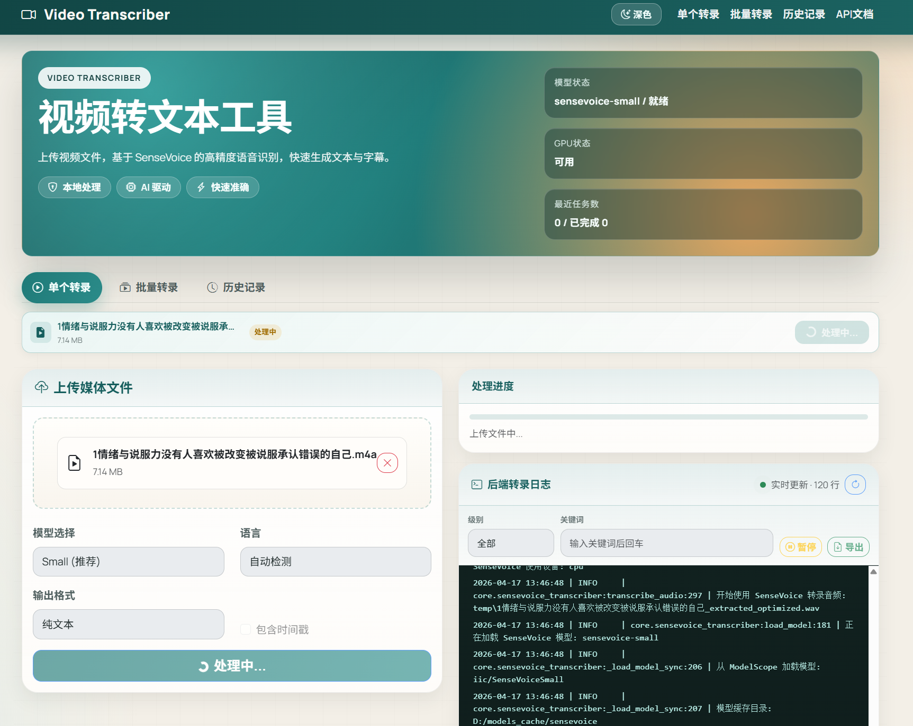

# Video Transcriber 🎥🎵➡️📝

[![zread](https://img.shields.io/badge/Ask_Zread-_.svg?style=flat&color=00b0aa&labelColor=000000&logo=data%3Aimage%2Fsvg%2Bxml%3Bbase64%2CPHN2ZyB3aWR0aD0iMTYiIGhlaWdodD0iMTYiIHZpZXdCb3g9IjAgMCAxNiAxNiIgZmlsbD0ibm9uZSIgeG1sbnM9Imh0dHA6Ly93d3cudzMub3JnLzIwMDAvc3ZnIj4KPHBhdGggZD0iTTQuOTYxNTYgMS42MDAxSDIuMjQxNTZDMS44ODgxIDEuNjAwMSAxLjYwMTU2IDEuODg2NjQgMS42MDE1NiAyLjI0MDFWNC45NjAxQzEuNjAxNTYgNS4zMTM1NiAxLjg4ODEgNS42MDAxIDIuMjQxNTYgNS42MDAxSDQuOTYxNTZDNS4zMTUwMiA1LjYwMDEgNS42MDE1NiA1LjMxMzU2IDUuNjAxNTYgNC45NjAxVjIuMjQwMUM1LjYwMTU2IDEuODg2NjQgNS4zMTUwMiAxLjYwMDEgNC45NjE1NiAxLjYwMDFaIiBmaWxsPSIjZmZmIi8%2BCjxwYXRoIGQ9Ik00Ljk2MTU2IDEwLjM5OTlIMi4yNDE1NkMxLjg4ODEgMTAuMzk5OSAxLjYwMTU2IDEwLjY4NjQgMS42MDE1NiAxMS4wMzk5VjEzLjc1OTlDMS42MDE1NiAxNC4xMTM0IDEuODg4MSAxNC4zOTk5IDIuMjQxNTYgMTQuMzk5OUg0Ljk2MTU2QzUuMzE1MDIgMTQuMzk5OSA1LjYwMTU2IDE0LjExMzQgNS42MDE1NiAxMy43NTk5VjExLjAzOTlDNS42MDE1NiAxMC42ODY0IDUuMzE1MDIgMTAuMzk5OSA0Ljk2MTU2IDEwLjM5OTlaIiBmaWxsPSIjZmZmIi8%2BCjxwYXRoIGQ9Ik0xMy43NTg0IDEuNjAwMUgxMS4wMzg0QzEwLjY4NSAxLjYwMDEgMTAuMzk4NCAxLjg4NjY0IDEwLjM5ODQgMi4yNDAxVjQuOTYwMUMxMC4zOTg0IDUuMzEzNTYgMTAuNjg1IDUuNjAwMSAxMS4wMzg0IDUuNjAwMUgxMy43NTg0QzE0LjExMTkgNS42MDAxIDE0LjM5ODQgNS4zMTM1NiAxNC4zOTg0IDQuOTYwMVYyLjI0MDFDMTQuMzk4NCAxLjg4NjY0IDE0LjExMTkgMS42MDAxIDEzLjc1ODQgMS42MDAxWiIgZmlsbD0iI2ZmZiIvPgo8cGF0aCBkPSJNNCAxMkwxMiA0TDQgMTJaIiBmaWxsPSIjZmZmIi8%2BCjxwYXRoIGQ9Ik00IDEyTDEyIDQiIHN0cm9rZT0iI2ZmZiIgc3Ryb2tlLXdpZHRoPSIxLjUiIHN0cm9rZS1saW5lY2FwPSJyb3VuZCIvPgo8L3N2Zz4K&logoColor=ffffff)](https://zread.ai/Acclerate/video-transcriber)


一个视频/音频文件转文本工具，基于SenseVoice实现高精度多语言语音识别。支持 MP4、MKV、AVI 等视频格式及 M4A、MP3、WAV、FLAC 等音频格式直接输入。
## ✨ 特性

- 📤 **文件上传**: 直接上传视频或音频文件进行处理（最大支持1GB）
- 🎵 **音频直传**: 支持 M4A、MP3、WAV、AAC、FLAC、OGG 等音频格式直接转录，无需视频容器
- 🤖 **高精度转录**: 基于SenseVoice，准确率95%+，中文优化
- 🔒 **隐私保护**: 本地处理，数据不外泄
- 🌐 **Web界面**: 简洁易用的Web界面
- ⚡ **批量处理**: 支持多个视频/音频同时转录
- 🎶 **智能音频**: 自动提取和优化音频质量
- 📝 **多种格式**: 支持JSON、TXT、SRT、VTT输出
- 🔄 **实时状态**: 实时显示处理进度
- 🎯 **长视频分割**: 自动将长音频分段处理，有效避免CUDA OOM错误，支持超长视频转录
- 🚀 **内存优化**: 智能分块 + CPU fallback，适配8GB显存设备
- 🧩 **智能分块**: 长音频自动分段处理，避免重复/卡顿
- 🔄 **自动重试**: 网络或临时错误自动重试
- 🇨🇳 **中文优化**: 默认中文转录，避免误识别为英语
- ✨ **标点符号**: 自动添加标点符号，提高可读性



## 🚀 快速开始

### 环境要求

- **Python 3.10.x** (强烈推荐)
- FFmpeg (用于音视频处理)
- 4GB+ RAM (推荐8GB以上)
- GPU (可选，用于加速)

#### Python版本说明

| 依赖包 | 版本 | 说明 |
|--------|------|------|
| PyTorch | >=2.1.0 | 核心推理框架 |
| torchaudio | >=0.13.0 | 音频处理，随 PyTorch 安装 |
| FunASR | >=1.0.0 | 阿里达摩院 ASR 框架 |
| ModelScope | >=1.0.0 | 模型下载与管理 |
| FastAPI | 0.104.1 | Web API 框架 |
| Pydantic | 2.5.2 | 数据校验与配置管理 |
| librosa | 0.10.1 | 音频分析与处理 |
| pydub | 0.25.1 | 音频格式转换 |
| loguru | 0.7.2 | 日志记录 |
| slowapi | 0.1.9 | API 速率限制 |

**推荐版本**:
- ⭐ **Python 3.12.x** - 推荐，最新稳定版
- ⭐ **Python 3.11.x** - 全部依赖支持
- ✅ **Python 3.10.x** - 最低要求

### 安装

1. **克隆项目**
```bash
git clone https://github.com/Acclerate/video-transcriber.git
cd video-transcriber
```


2. **安装依赖**
```bash
# 确保使用 Python 3.10 (推荐)
python --version

# 创建虚拟环境 (使用 Python 3.10)
python3.10 -m venv venv
# 或使用 conda (推荐)
# conda create -n video-transcriber python=3.10
# conda activate video-transcriber

source venv/bin/activate  # Windows: venv\Scripts\activate

# 安装Python依赖
pip install -r requirements.txt

# 安装FFmpeg (Ubuntu/Debian)
sudo apt update
sudo apt install ffmpeg

# 安装FFmpeg (macOS)
brew install ffmpeg

# 安装FFmpeg (Windows 10/11)
# 方法1: 使用 winget (推荐, Windows 11/10 最新版)
winget install ffmpeg
# 或使用 Chocolatey
# choco install ffmpeg

# 方法2: 使用 Scoop
scoop install ffmpeg

# 方法3: 手动安装
# 1. 下载: https://www.gyan.dev/ffmpeg/builds/ffmpeg-release-essentials.zip
# 2. 解压到 C:\ffmpeg
# 3. 添加 C:\ffmpeg\bin 到系统 PATH 环境变量
#    - 右键"此电脑" -> 属性 -> 高级系统设置 -> 环境变量
#    - 在"系统变量"中找到 Path, 点击编辑, 添加 C:\ffmpeg\bin
# 4. 重启终端, 验证安装: ffmpeg -version

# 方法4: 使用项目自带 (无需系统安装)
# 项目已包含 ffmpeg_bin 目录, 程序会自动使用
# 如需手动指定: 设置环境变量 FFMPEG_PATH=D:\privategit\github\video-transcriber\ffmpeg_bin\ffmpeg.exe
```

3. **安装 SenseVoice 依赖**
```bash
# 安装 FunASR 和 ModelScope
pip install funasr modelscope
```

4. **下载 SenseVoice 模型**
```bash
# 从 ModelScope（阿里云）下载 SenseVoice 模型
python webmain.py download-model sensevoice-small

# 查看所有可用命令
python webmain.py --help
```

5. **启动服务**
```bash
# 启动Web服务
python webmain.py serve

# 访问 http://localhost:8665
```

### 快速安装（Windows）

如果您使用 Windows 和 conda，可以按照以下步骤快速安装：

```powershell
# 第一步：激活环境
conda activate video-transcriber

# 第二步：安装依赖
cd D:\privategit\github\video-transcriber

# 安装 SenseVoice 依赖
pip install funasr modelscope

# 第三步：下载 SenseVoice 模型
python webmain.py download-model sensevoice-small

# 第四步：启动服务
python webmain.py serve
```

## 📖 使用方法

### Web界面使用

1. 启动服务:
```bash
python webmain.py serve
```

2. 访问 `http://localhost:8665`

3. 使用方式:
   - **单个转录**: 上传视频或音频文件，选择模型和语言，点击开始转录
   - **批量转录**: 一次上传多个视频/音频文件（最多20个），自动批量处理

### API 使用

```bash
# 启动API服务
uvicorn api.apimain:app --host 0.0.0.0 --port 8665

# 访问API文档
# http://localhost:8665/docs
```

```python
import requests

# 单个文件转录（视频）
files = {"files": open("video.mp4", "rb")}
data = {
    "model": "sensevoice-small",
    "language": "zh",  # 中文
    "format": "json"
}
response = requests.post("http://localhost:8665/api/v1/transcribe/file", files=files, data=data)

result = response.json()
print(result["data"]["transcription"]["text"])

# 单个文件转录（音频，如 m4a）
files = {"files": open("recording.m4a", "rb")}
data = {"model": "sensevoice-small", "language": "zh", "format": "txt"}
response = requests.post("http://localhost:8665/api/v1/transcribe/file", files=files, data=data)

# 批量转录（可混合视频和音频）
files = [("files", open(f"video{i}.mp4", "rb")) for i in range(3)]
data = {
    "model": "sensevoice-small",
    "language": "zh",
    "max_concurrent": "2"
}
response = requests.post("http://localhost:8665/api/v1/transcribe/batch", files=files, data=data)
```

### 命令行使用

```bash
# 基础转录（视频）
python webmain.py transcribe /path/to/video.mp4

# 直接转录音频文件（m4a、mp3、wav、flac 等）
python webmain.py transcribe /path/to/recording.m4a
python webmain.py transcribe /path/to/podcast.mp3
python webmain.py transcribe /path/to/interview.wav

# 指定模型
python webmain.py transcribe /path/to/video.mp4 --model sensevoice-small

# 指定语言
python webmain.py transcribe /path/to/recording.m4a --language zh

# 生成带时间戳的字幕文件（SRT/VTT格式）
python webmain.py transcribe /path/to/video.mp4 --format srt --timestamps

# 批量处理（文件列表可混合视频和音频路径）
python webmain.py batch file_list.txt

# 指定输出格式 (txt/json/srt/vtt)
python webmain.py transcribe /path/to/video.mp4 --format srt

# 查看系统信息
python webmain.py info

# 查看可用模型
python webmain.py models
```

#### 字幕时间戳生成（CLI 重点功能）

**生成 SRT 字幕文件**：
```bash
# 基础 SRT 字幕（带时间戳）
python webmain.py transcribe video.mp4 --format srt --timestamps

# 安静模式（减少日志输出）
python webmain.py transcribe video.mp4 --format srt --timestamps --quiet

# 指定输出文件名
python webmain.py transcribe video.mp4 --format srt --timestamps -o output.srt
```

**字幕时间戳对齐机制**：

项目使用 **FA（Forced Aligner，强制对齐）** 技术来生成精确的字幕时间戳：

1. **SenseVoice 粗粒度时间戳**：SenseVoice 模型提供基础的字符级时间戳
2. **FA 精确对齐**：使用 FunASR 的 `fa-zh` 模型进行强制对齐，获取逐字精确时间戳
3. **时间戳修正**：自动检测并修复时间重叠，确保字幕不叠加显示
4. **智能断句**：基于标点符号和语义进行自然断句，避免在不自然的位置切分

**字幕切分规则**：
- 句末标点（。！？!?）→ 必须断句
- 逗号/分号（，,；;）→ 句子够长时断句
- 英文单词保护 → 不会从单词中间切分（如 `CIRCLE`、`MONGODB`）
- 中文字符保护 → 避免在助词、介词等不自然位置切分

**时间偏移调整**（可选）：

如果字幕与声音不同步，可通过环境变量调整：

```bash
# 字幕比声音快 → 延迟字幕（正值）
set FA_TIME_OFFSET=0.2
python webmain.py transcribe video.mp4 --format srt --timestamps

# 字幕比声音慢 → 提前字幕（负值）
set FA_TIME_OFFSET=-0.1
python webmain.py transcribe video.mp4 --format srt --timestamps

# 或在 .env 文件中设置
FA_TIME_OFFSET=0.2  # 正值延迟，负值提前
```

**输出示例**（SRT 格式）：
```srt
1
00:00:01,010 --> 00:00:04,410
这堂课呢我们对MONGODB做一个简单的介绍

2
00:00:04,410 --> 00:00:07,346
那么MONGODB呢是一个基于文档的
```

## 🛠️ 配置选项

### 环境变量配置

创建 `.env` 文件（参考 `.env.example`）:

```env
# ============================================================
# 服务配置
# ============================================================
HOST=0.0.0.0
PORT=8665
DEBUG=false

# ============================================================
# SenseVoice 语音识别配置
# ============================================================
# 默认模型: sensevoice-small
DEFAULT_MODEL=sensevoice-small

# 默认转录语言: zh(中文), en(英语), ja(日语), ko(韩语), auto(自动检测)
# 默认使用中文以获得最佳识别效果
DEFAULT_LANGUAGE=zh

# ============================================================
# 字幕时间戳配置
# ============================================================
# FA (强制对齐) 时间偏移配置（秒）
# 正值延迟字幕，负值提前字幕
# 用于微调字幕与声音的同步
# 典型值：0.1-0.3 秒（字幕比声音快时），-0.1 秒（字幕比声音慢时）
FA_TIME_OFFSET=0.0

# ============================================================
# 音频处理配置
# ============================================================
# 音频分块处理配置
# 长音频分段处理可提高准确率和性能，避免CUDA OOM
ENABLE_AUDIO_CHUNKING=true
CHUNK_DURATION_SECONDS=300        # 每块5分钟（适配8GB显存）
CHUNK_OVERLAP_SECONDS=2           # 块之间重叠2秒
MIN_DURATION_FOR_CHUNKING=600     # 超过10分钟的音频才启用分块

# 是否启用GPU加速
ENABLE_GPU=true

# 模型缓存目录
MODEL_CACHE_DIR=./models_cache

# ============================================================
# 文件配置
# ============================================================
# 临时文件目录
TEMP_DIR=./temp

# 最大文件大小 (MB)
MAX_FILE_SIZE=1024  # 1GB

# 清理临时文件间隔 (秒)
CLEANUP_AFTER=3600

# ============================================================
# 日志配置
# ============================================================
# 日志级别: DEBUG, INFO, WARNING, ERROR
LOG_LEVEL=INFO

# 日志文件路径
LOG_FILE=./logs/app.log

# 是否输出到控制台
LOG_TO_CONSOLE=true

# ============================================================
# 任务配置
# ============================================================
# 最大并发任务数
MAX_CONCURRENT_TASKS=3

# 任务超时时间 (秒)
TASK_TIMEOUT=3600

# ============================================================
# API 配置
# ============================================================
# API 密钥 (可选，用于认证)
API_KEY=

# 请求频率限制 (请求/分钟)
RATE_LIMIT_PER_MINUTE=60

# CORS 允许的源 (生产环境请设置具体域名)
CORS_ORIGINS=["*"]
```

### SenseVoice模型选择

| 模型 | 大小 | 速度 | 准确率 | 推荐场景 |
|------|------|------|--------|----------|
| sensevoice-small | 244MB | 快 | 很好 | **推荐**，多语言支持 |

**模型特点**:
- 支持中文、英语、日语、韩语、粤语等多种语言
- 对中文等亚洲语言优化，准确率更高
- 自动语言检测
- 支持情感识别和中英文混合识别

### 支持的语言

| 语言代码 | 语言 | 语言代码 | 语言 |
|----------|------|----------|------|
| zh | 中文 | es | 西班牙语 |
| en | 英语 | fr | 法语 |
| ja | 日语 | de | 德语 |
| ko | 韩语 | ru | 俄语 |
| auto | 自动检测 | - | - |

### 支持的媒体格式

> 视频和音频文件均可直接作为输入，无需手动转换。

#### 视频格式

| 格式 | 扩展名 | 状态 |
|------|--------|------|
| MP4 | .mp4 | ✅ |
| M4V | .m4v | ✅ |
| AVI | .avi | ✅ |
| MKV | .mkv | ✅ |
| MOV | .mov | ✅ |
| WMV | .wmv | ✅ |
| FLV | .flv | ✅ |
| WebM | .webm | ✅ |
| MPEG | .mpeg, .mpg, .mp2 | ✅ |

#### 音频格式（直接输入）

| 格式 | 扩展名 | 状态 |
|------|--------|------|
| MP3 | .mp3 | ✅ |
| WAV | .wav | ✅ |
| M4A | .m4a | ✅ |
| AAC | .aac | ✅ |
| FLAC | .flac | ✅ |
| OGG | .ogg | ✅ |
| WMA | .wma | ✅ |

## 📁 项目结构

```
video-transcriber/
├── 📄 README.md                  # 项目说明
├── 📄 CODE_REVIEW_REPORT.md      # 代码审查报告
├── 📄 requirements.txt           # Python依赖
├── 📄 .env.example               # 配置模板
├── 📄 webmain.py                 # 命令行入口
├── 📁 api/                       # Web API层
│   ├── 📄 apimain.py             # FastAPI应用
│   ├── 📁 routes/                # API路由
│   │   ├── health.py             # 健康检查
│   │   ├── transcribe.py         # 转录接口
│   │   ├── tasks.py              # 任务查询接口
│   │   └── system.py             # 系统管理接口
│   └── 📄 websocket.py           # WebSocket处理
├── 📁 core/                      # 核心业务层
│   ├── 📄 engine.py              # 转录引擎
│   ├── 📄 sensevoice_transcriber.py  # SenseVoice语音转录器
│   └── 📄 downloader.py          # 音频提取器
├── 📁 services/                  # 服务层
│   ├── 📄 transcription_service.py
│   ├── 📄 file_service.py
│   └── 📄 task_service.py
├── 📁 models/                    # 数据模型层
│   └── 📄 schemas.py             # Pydantic模型
├── 📁 config/                    # 配置管理
│   ├── 📄 settings.py            # 应用配置
│   └── 📄 constants.py           # 常量定义
├── 📁 utils/                     # 工具函数
│   ├── 📁 audio/                 # 音频工具
│   │   └── 📄 chunking.py        # 分块处理
│   ├── 📁 common/                # 通用工具
│   ├── 📁 ffmpeg/                # FFmpeg工具
│   ├── 📁 file/                  # 文件工具
│   └── 📁 logging/               # 日志工具
├── 📁 web/                       # Web前端
│   ├── 📄 index.html
│   ├── 📄 style.css
│   └── 📄 script.js
├── 📁 tests/                     # 测试文件
├── 📁 docker/                    # Docker配置
└── 📁 temp/                      # 临时文件目录
```

## 📝 API 端点

### 核心端点

| 端点 | 方法 | 描述 |
|------|------|------|
| `/api/v1/health` | GET | 健康检查 |
| `/api/v1/transcribe/file` | POST | 上传视频/音频文件转录 |
| `/api/v1/transcribe/batch` | POST | 批量转录（多文件上传，支持视频/音频混合） |
| `/api/v1/task/{task_id}` | GET | 查询任务状态 |
| `/api/v1/tasks` | GET | 列出最近的任务 |
| `/api/v1/models` | GET | 获取可用模型 |
| `/api/v1/stats` | GET | 获取统计信息 |
| `/ws/transcribe` | WS | WebSocket实时转录 |

### 请求示例

```bash
# 单个文件转录（视频）
curl -X POST "http://localhost:8665/api/v1/transcribe/file" \
  -F "files=@video.mp4" \
  -F "model=sensevoice-small" \
  -F "language=zh" \
  -F "format=json"

# 单个文件转录（音频，如 m4a / mp3 / wav）
curl -X POST "http://localhost:8665/api/v1/transcribe/file" \
  -F "files=@recording.m4a" \
  -F "model=sensevoice-small" \
  -F "language=zh" \
  -F "format=txt"

# 批量转录 (最多20个文件)
curl -X POST "http://localhost:8665/api/v1/transcribe/batch" \
  -F "files=@video1.mp4" \
  -F "files=@video2.mp4" \
  -F "files=@video3.mp4" \
  -F "model=sensevoice-small" \
  -F "max_concurrent=2"

# 查询任务状态
curl "http://localhost:8665/api/v1/task/{task_id}"

# 列出最近的任务
curl "http://localhost:8665/api/v1/tasks?limit=10&status=completed"

# 获取统计信息
curl "http://localhost:8665/api/v1/stats"
```

## ⚡ 性能指标

### 处理速度 (基于SenseVoice Small模型)
- **短视频** (0-1分钟): ~5-10秒
- **中等视频** (1-5分钟): ~15-30秒
- **长视频** (5-10分钟): ~30-60秒
- **超长视频** (1小时+): ~30-60分钟（使用分块处理）

**注意**: 长视频使用分块处理会增加总处理时间，但能有效避免内存溢出错误。

### 准确率
- **中文**: 95%+ (SenseVoice对中文优化)
- **英文**: 95%+
- **日韩语**: 90%+
- **中英混合**: 93%+

### 资源消耗
- **CPU**: 2-4核推荐
- **内存**: 4GB+ (SenseVoice Small模型)
- **GPU**: 可选，2-3倍加速效果
- **磁盘**: 临时文件约50-200MB/媒体文件

## 🐛 故障排除

### 常见问题及解决方案

#### 1. FFmpeg 未找到

**症状**: 启动时报错 `FFmpeg not found`

**解决方案**:
```bash
# 检查FFmpeg是否已安装
ffmpeg -version

# Ubuntu/Debian
sudo apt update
sudo apt install ffmpeg

# macOS
brew install ffmpeg

# Windows
# 1. 下载: https://ffmpeg.org/download.html
# 2. 解压并添加到PATH环境变量
# 3. 或使用项目自带的 ffmpeg_bin 目录
```

#### 2. 转录出现乱码或错误语言

**症状**: 中文被识别为英语或其他语言

**解决方案**:
```bash
# 方法1: 在API请求中指定语言
curl -X POST "http://localhost:8665/api/v1/transcribe/file" \
  -F "files=@video.mp4" \
  -F "language=zh"

# 方法2: 修改默认配置
# 编辑 .env 文件
DEFAULT_LANGUAGE=zh

# 方法3: 命令行指定
python webmain.py transcribe video.mp4 --language zh
```

#### 3. 长音频卡顿或重复

**症状**: 长视频转录时卡住或重复内容

**解决方案**:
```bash
# 启用音频分块处理（已默认启用）
# 编辑 .env 文件确认以下配置:
ENABLE_AUDIO_CHUNKING=true
CHUNK_DURATION_SECONDS=300    # 每块5分钟
MIN_DURATION_FOR_CHUNKING=600 # 超过10分钟才分块

# 对于超长音频（1小时+），缩短分块时长:
CHUNK_DURATION_SECONDS=120    # 改为2分钟
MIN_DURATION_FOR_CHUNKING=300 # 降低到5分钟
```

#### 4. 内存不足 (CUDA Out Of Memory)

**症状**: 报错 `CUDA out of memory` 或程序崩溃

**解决方案**:
```bash
# 方法1: 启用音频分块（推荐，已默认启用）
ENABLE_AUDIO_CHUNKING=true
CHUNK_DURATION_SECONDS=300    # 每块5分钟
MIN_DURATION_FOR_CHUNKING=600 # 超过10分钟才分块

# 方法2: 缩小块大小（对于超长视频）
CHUNK_DURATION_SECONDS=120    # 改为2分钟
MIN_DURATION_FOR_CHUNKING=180 # 降低到3分钟

# 方法3: 禁用GPU，使用CPU模式
ENABLE_GPU=false

# 方法4: 减少并发数
MAX_CONCURRENT_TASKS=1

# 注意：超过10分钟的长音频会自动切换到CPU模式，避免GPU OOM
```

#### 5. GPU加速不生效

**症状**: 使用GPU但速度没有提升

**解决方案**:
```bash
# 检查CUDA可用性
python -c "import torch; print(torch.cuda.is_available())"

# 安装CUDA支持的PyTorch
pip install torch torchaudio --index-url https://download.pytorch.org/whl/cu118

# 确认配置
ENABLE_GPU=true
```

#### 6. 文件上传失败

**症状**: 上传时中断或报错

**解决方案**:
```bash
# 检查文件大小限制
MAX_FILE_SIZE=500  # 增加限制值

# 检查临时目录权限
TEMP_DIR=./temp
chmod 755 ./temp

# 检查磁盘空间
df -h
```

#### 7. 依赖安装失败

**症状**: pip install 报错

**解决方案**:
```bash
# 更新pip
python -m pip install --upgrade pip

# 使用国内镜像源
pip install -r requirements.txt -i https://pypi.tuna.tsinghua.edu.cn/simple

# 单独安装问题依赖
pip install funasr modelscope
pip install torch
pip install pydub
```

#### 8. WebSocket 连接断开

**症状**: 实时进度推送中断

**解决方案**:
```bash
# 检查心跳超时配置（默认5分钟）
# 如果网络不稳定，可以在代码中调整超时时间

# 检查代理设置
# 确保WebSocket不被代理拦截
```

### 性能优化建议

#### 1. GPU加速配置

```bash
# 安装CUDA支持的PyTorch
pip install torch torchaudio --index-url https://download.pytorch.org/whl/cu118

# 启用GPU
ENABLE_GPU=true
```

#### 2. 模型预加载

```bash
# 首次运行时预下载模型
python webmain.py download-model sensevoice-small
```

#### 3. 批量处理优化

```bash
# 根据硬件调整并发数
# CPU: max_concurrent=1-2
# GPU: max_concurrent=2-4
curl -X POST "http://localhost:8665/api/v1/transcribe/batch" \
  -F "files=@video1.mp4" \
  -F "max_concurrent=2"
```

#### 4. 分块处理优化

```env
# 对于特别长的音频（1小时+），缩短块大小
CHUNK_DURATION_SECONDS=120    # 缩短到2分钟
CHUNK_OVERLAP_SECONDS=2        # 块之间重叠2秒

# 对于8GB显存设备
CHUNK_DURATION_SECONDS=300     # 默认5分钟
MIN_DURATION_FOR_CHUNKING=600  # 超过10分钟才分块
```

### 错误代码对照表

| 错误代码 | HTTP状态 | 说明 | 解决方案 |
|----------|----------|------|----------|
| INVALID_FILE | 400 | 文件格式不支持 | 检查文件格式 |
| FILE_TOO_LARGE | 413 | 文件超过大小限制 | 压缩视频或增加MAX_FILE_SIZE |
| MODEL_LOAD_FAILED | 500 | 模型加载失败 | 检查网络/磁盘空间，重试 |
| TRANSCRIPTION_FAILED | 500 | 转录失败 | 查看日志，检查音频质量 |
| TIMEOUT | 504 | 处理超时 | 增加TASK_TIMEOUT或使用分块处理 |

## 🎬 长视频处理指南

### 音频分块处理机制

本项目采用智能音频分块技术来处理长视频，有效避免 CUDA OOM 错误：

#### 工作原理

1. **自动检测**: 当音频时长超过 `MIN_DURATION_FOR_CHUNKING`（默认600秒/10分钟）时自动启用分块
2. **快速分割**: 使用 ffmpeg 将音频分割成多个块（默认每块300秒/5分钟）
3. **独立转录**: 每个块独立进行语音识别，处理完一个块后卸载模型释放内存
4. **智能合并**: 自动合并各块的转录结果，去除重叠部分

#### 分块配置说明

| 配置项 | 默认值 | 说明 |
|--------|--------|------|
| `ENABLE_AUDIO_CHUNKING` | true | 是否启用音频分块 |
| `CHUNK_DURATION_SECONDS` | 300 | 每块时长（秒） |
| `CHUNK_OVERLAP_SECONDS` | 2 | 块之间重叠时间（秒） |
| `MIN_DURATION_FOR_CHUNKING` | 600 | 超过此时长才启用分块（秒） |

#### 分块大小建议

| 显存大小 | 推荐块大小 | 适用场景 |
|----------|-----------|----------|
| 4GB | 60-120秒 | 短视频 |
| 8GB | 120-300秒 | 中长视频（默认300秒） |
| 12GB+ | 300-600秒 | 长视频 |

#### 处理时长参考

以82分钟（4920秒）音频为例：

| 块大小 | 块数量 | 预计处理时间 | 显存占用 |
|--------|--------|-------------|----------|
| 120秒 | ~41块 | 约40-60分钟 | ~2-3GB/块 |
| 300秒 | ~16块 | 约30-45分钟 | ~4-6GB/块 |
| 600秒 | ~8块 | 约25-35分钟 | ~7-8GB/块 |

#### 智能设备选择

系统会根据音频时长自动选择处理设备：

- **≤10分钟**: 使用 GPU（如果启用）
- **>10分钟**: 自动切换到 CPU 模式，避免 GPU OOM

#### 优化技巧

```env
# 超长视频（2小时+）
CHUNK_DURATION_SECONDS=120
MIN_DURATION_FOR_CHUNKING=300

# 中等长度视频（30分钟-2小时）
CHUNK_DURATION_SECONDS=300
MIN_DURATION_FOR_CHUNKING=600

# 短视频（<30分钟）
CHUNK_DURATION_SECONDS=600
MIN_DURATION_FOR_CHUNKING=1800
```

## 🐳 Docker 使用

### 构建镜像

```bash
docker build -t video-transcriber .
```

### 运行容器

```bash
# 基础运行
docker run -p 8665:8665 -v $(pwd)/temp:/app/temp video-transcriber

# 使用GPU
docker run --gpus all -p 8665:8665 -v $(pwd)/temp:/app/temp video-transcriber

# 指定配置
docker run -p 8665:8665 \
  -e ENABLE_GPU=true \
  -e DEFAULT_MODEL=small \
  -v $(pwd)/temp:/app/temp \
  video-transcriber
```

### Docker Compose

```yaml
version: '3.8'
services:
  video-transcriber:
    build: .
    ports:
      - "8665:8665"
    environment:
      - ENABLE_GPU=true
      - DEFAULT_MODEL=small
      - DEFAULT_LANGUAGE=zh
      - ENABLE_AUDIO_CHUNKING=true
    volumes:
      - ./temp:/app/temp
      - ./models_cache:/app/models_cache
    restart: unless-stopped
```

## 🔧 开发指南

### 开发环境搭建

```bash
# 安装开发依赖
pip install -r requirements.txt

# 安装测试依赖
pip install pytest pytest-asyncio pytest-cov

# 运行测试
pytest

# 代码格式化
black .
isort .

# 类型检查
mypy .
```

### 运行测试

```bash
# 所有测试
pytest

# 单个测试文件
pytest tests/test_api.py

# 带覆盖率报告
pytest --cov=. --cov-report=html
```

## 🗺️ 开发路线图

### 即将推出的功能 🚀

#### AI 内容增强功能

- **🤖 OpenAI 接口接入**
  - 支持 GPT-4/GPT-4o 模型集成
  - 兼容 OpenAI 兼容接口（如 Azure OpenAI、国内大模型服务）
  - 灵活的 API Key 配置管理

- **📝 智能内容总结**
  - 自动生成视频内容摘要
  - 提炼核心观点和关键信息
  - 支持多语言总结输出
  - 可配置总结长度和详细程度

- **💡 关键句/词解释**
  - 自动识别专业术语和关键概念
  - 提供上下文相关的解释说明
  - 支持中英文术语对照
  - 可生成术语表和知识点清单

- **📊 内容结构化分析**
  - 识别视频章节和话题转折
  - 提取论点、论据和结论
  - 生成结构化思维导图

#### 功能增强计划

- **🎤 说话人识别（Speaker Diarization）**
  - 区分不同说话人
  - 生成对话式字幕

- **🌍 多语言翻译**
  - 转录结果自动翻译
  - 支持多语言字幕生成

- **📦 本地模型支持**
  - 集成开源 LLM（如 LLaMA、Qwen）
  - 完全离线的智能分析

### 技术优化 ⚡

- [ ] 模型量化与加速
- [ ] 流式转录支持
- [x] ~~更多音频格式支持~~ — 已完成：M4A、MP3、WAV、AAC、FLAC、OGG、WMA 均可直接输入
- [ ] 分布式处理能力

### 优先级说明

| 功能 | 优先级 | 预计版本 | 状态 |
| --- | --- | --- | --- |
| OpenAI 接口接入 | 🔥 高 | v1.2.0 | 计划中 |
| 智能内容总结 | 🔥 高 | v1.2.0 | 计划中 |
| 关键句/词解释 | 🔥 高 | v1.3.0 | 计划中 |
| 说话人识别 | 中 | v1.4.0 | 待评估 |
| 多语言翻译 | 中 | v1.5.0 | 待评估 |
| 本地模型支持 | 低 | v2.0.0 | 待评估 |

## 📚 相关文档

- [代码审查报告](CODE_REVIEW_REPORT.md) - 详细的代码质量分析
- [项目总结](PROJECT_SUMMARY.md) - 项目技术总结
- [API文档](http://localhost:8665/docs) - Swagger自动生成的API文档

## 🤝 贡献指南

欢迎贡献代码！请遵循以下步骤：

1. Fork 项目
2. 创建特性分支 (`git checkout -b feature/AmazingFeature`)
3. 提交改动 (`git commit -m 'Add some AmazingFeature'`)
4. 推送到分支 (`git push origin feature/AmazingFeature`)
5. 开启 Pull Request

## 📄 许可证

本项目采用 MIT 许可证 - 查看 [LICENSE](LICENSE) 文件了解详情。

## 🙏 致谢

- [SenseVoice/FunASR](https://github.com/modelscope/FunASR) - 阿里达摩院语音识别模型
- [FastAPI](https://fastapi.tiangolo.com/) - 现代Web框架
- [pydub](https://github.com/jiaaro/pydub) - 音频处理库

## 📞 联系方式

- 项目链接: [https://github.com/Acclerate/video-transcriber](https://github.com/Acclerate/video-transcriber)
- 问题反馈: [Issues](https://github.com/Acclerate/video-transcriber/issues)

---

**如果这个项目对你有帮助，请给个 ⭐ Star 支持一下！**
